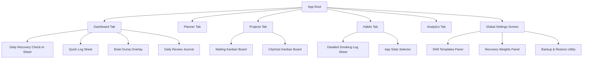

# 07 Information Architecture

**Document ID:** 07_Information_Architecture.md  
**Version:** 1.0  
**Status:** Approved  
**Owner:** UI/UX Designer  
**Last Updated:** July 2026  

---

## 1. Purpose
The purpose of this document is to define the **Information Architecture (IA)** and sitemap hierarchy of LifeOS. It outlines how directories, screens, preferences, and data blocks are structured logically.

---

## 2. Sitemap Hierarchy
LifeOS utilizes a flat sitemap designed to prevent navigation depth from exceeding 3 tiers:

---

## 3. Data Context & Parameter Passing

### 3.1 Routing Parameters
To prevent circular references and state inconsistencies, the navigation framework (GoRouter) passes parameters as primitive data types:
- **Project Navigation:** Navigating from the Dashboard to the Projects tab passes the project ID string (e.g. `projectId: "mailing"`).
- **Task Editing:** Opening the Task Details modal passes the task ID string (`taskId: "task-001"`).
- **Log Backfill:** Navigating to historical edits passes the target Date string in ISO format (`date: "2026-07-12"`).

---

## 4. Dependencies
- **Product/03_User_Flows.md:** User flows and page transitions.
- **Design/08_UI_UX_Specification.md:** Screen layouts.

---

## 5. Acceptance Criteria
- All routes and navigation paths trace back to the sitemap tree.
- App parameters conform to primitive data types to allow local deep linking.

---

## 6. Revision History
| Version | Date | Author | Description |
|---|---|---|---|
| 1.0 | July 13, 2026 | Antigravity | Initial sitemap design and parameters mapping. |