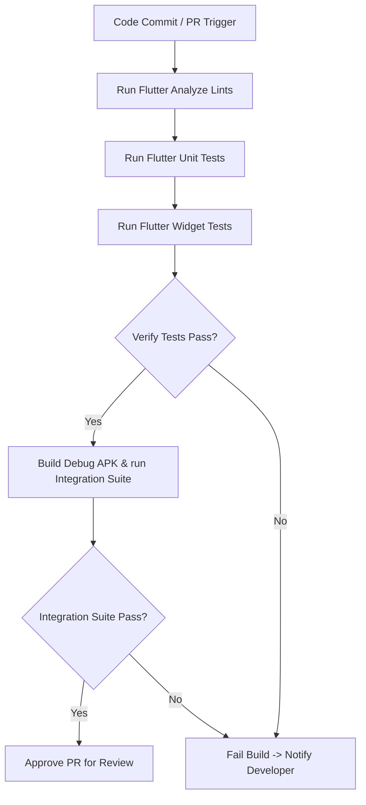

# 23 Testing Strategy

**Document ID:** 23_Testing.md  
**Version:** 1.0  
**Status:** In Progress  
**Owner:** Technical Lead  
**Last Updated:** July 2026  

---

## 1. Purpose
The purpose of this document is to specify the **Testing Strategy** for LifeOS. It outlines the testing methodologies, frameworks, test suites, and validation metrics used to guarantee application reliability.

---

## 2. Testing Levels

### 2.1 Unit Testing (package:flutter_test)
- **Target:** Business logic, Scoring calculations, Rules Engine triggers, and helper services.
- **Coverage Goal:** $\ge 85\%$ code coverage for computational logic (rules, score, algorithms).
- **Rule:** Mock all Hive database boxes and platform channels during unit testing.

### 2.2 Widget Testing (package:flutter_test)
- **Target:** Layout render assertions, screen flows, state triggers, and empty/error states.
- **Goal:** Verify widgets render correctly under different themes (Light/Dark) and device dimensions.

### 2.3 Integration Testing (package:integration_test)
- **Target:** Standalone APK behavior, database file writes, platform permissions handling, and backup restores.
- **Goal:** Simulate user journeys (e.g. Morning Shift Day, Night Shift Day) end-to-end on local Android emulators.

---

## 3. Manual & Acceptance Testing
- **Manual Checklist:** Testing physical notifications delivery, Doze Mode bypasses, and Android Usage Stats API imports.
- **Acceptance Criteria Validation:** Verification of features against requirements defined in [04_Requirement_Catalog.md](file:///d:/LifeOS/Product/04_Requirement_Catalog.md).

---

## 4. Workflows

### 4.1 Continuous Integration (CI) Testing Pipeline

---

## 5. Dependencies
- **package:flutter_test:** Unit and widget test suite runner.
- **package:integration_test:** Android hardware emulator runner.

---

## 6. Acceptance Criteria
- Code changes cannot merge to `dev` if unit test coverage drops below $80\%$.
- All integration test runs complete successfully without unhandled exceptions.

---

## 7. Revision History
| Version | Date | Author | Description |
|---|---|---|---|
| 1.0 | July 13, 2026 | Antigravity | Initial draft detailing tests level configurations and pipelines. |