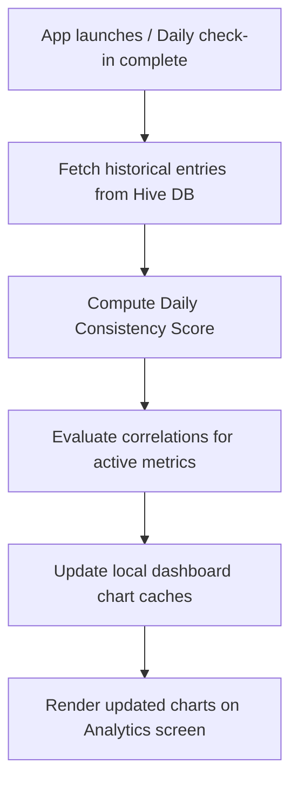

# 2.10 Analytics

**Document ID:** 2.10_Analytics.md  
**Version:** 1.0  
**Status:** In Progress  
**Owner:** Product Owner  
**Last Updated:** July 2026  

---

## 1. Purpose
The purpose of this document is to define the local processing, calculation methods, and user interface outputs of **MOD-Analytics** in LifeOS. The analytics module tracks behavioral, performance, and health metrics to provide insights while maintaining data privacy.

---

## 2. Objectives
- Compute daily and weekly productivity and habit consistency scores.
- Model local correlations (e.g., stress rating vs. smoking count) to identify wellness patterns.
- Visualize historical trends on-device with zero server dependencies.

---

## 3. Scope
This document details metrics logic, aggregate schedules, and visualization properties. It excludes specific chart UI package choices (defined in [09_Design_System.md](file:///d:/LifeOS/Design/09_Design_System.md)) and low-level code calculations (defined in [17_Analytics_Engine.md](file:///d:/LifeOS/Technical/17_Analytics_Engine.md)).

---

## 4. System Requirements

| Requirement ID | Description | Priority | Traceability |
|---|---|---|---|
| **REQ-ANAL-001** | The application shall compile data and render charts for **Consistency Scores** over 7-day, 30-day, and 12-month views. | Critical | MOD-Analytics |
| **REQ-ANAL-002** | The application shall cross-reference and plot correlations (e.g. Sleep Duration vs. Daily Consistency). | High | MOD-Analytics |
| **REQ-ANAL-003** | All analytical charts must render and scale responsively on mobile screens. | High | MOD-Analytics |
| **REQ-ANAL-004** | All calculations must run on-device. No telemetry, crash logs, or user usage data shall be exported to external hosts. | Critical | RULE-GOAL-002 |

---

## 5. Metrics & Correlation Specifications

### 5.1 Habit Tracking Analytics: Smoking
- **Daily Counts:** Line chart showing the sum of daily logged cigarettes.
- **Trigger Distribution:** Horizontal bar chart representing the frequency of each logged trigger:
  - Stress, Boredom, Friends, Work, Craving, Habit, Other.
- **Trigger Heatmap:** 24-hour hourly grid showing counts to isolate peak smoking hours.

### 5.2 Screen Time Analytics
- **Aggregated View:** Stacked bar chart showing total daily screen time and specific application breakdowns:
  - Instagram, YouTube, Chrome, WhatsApp, Other.
- **Comparison Metric:** Highlight deviation against a configured screen time ceiling target (e.g. target: $< 2$ hours/day).

### 5.3 Project Hours Allocation
- **Project Split:** Pie chart/donut chart showing total hours worked on **Mailing** vs. **CityHost**.
- **Weekly Target Tracking:** Double bar chart showing actual hours logged vs. target goals:
  - Mailing (e.g., target: 20 hours/week)
  - CityHost (e.g., target: 10 hours/week)

### 5.4 Wellness Correlations
The system calculates Pearson Correlation Coefficient ($r$) between variables:
$$r = \frac{\sum (x - \bar{x})(y - \bar{y})}{\sqrt{\sum (x - \bar{x})^2 \sum (y - \bar{y})^2}}$$

Calculated correlations include:
1. **Stress vs. Smoking:** Rate of cigarettes logged on days with high stress ratings (rating $\ge 7$) vs. low stress.
2. **Sleep Duration vs. Focus:** Sleep duration against deep work hours logged the following day.
3. **Shift Type vs. Sleep Quality:** Average sleep quality rating per shift template type.

---

## 6. Workflows

### 6.1 Daily Analytics Refresh Workflow

---

## 7. Edge Cases
- **Insufficient Data:** If the database contains fewer than 7 days of entries, correlation graphs must show a placeholder explanation card instead of drawing inaccurate or empty lines.
- **Zero Values:** Handled safely in code ($0$ hours, $0$ cigarettes) to prevent division by zero errors during averages and correlation evaluations.

---

## 8. Dependencies
- **Hive DB:** Historical data repository.
- **MOD-Tasks & MOD-Habits:** Provides raw log records.

---

## 9. Open Questions
- **None:** The analytics inputs and correlation algorithms are fully mapped.

---

## 10. Acceptance Criteria
- Correlation graphs load in under 100ms when switching to the analytics tab.
- All aggregations match the manual inputs exactly, with no data leakage or external telemetry calls.

---

## 11. Approval Checklist
- [x] Conforms to documentation rules.
- [ ] Reviewed by Product Owner.
- [ ] Locked for changes.

---

## 12. Revision History
| Version | Date | Author | Description |
|---|---|---|---|
| 1.0 | July 13, 2026 | Antigravity | Initial draft of the Analytics module specification. |