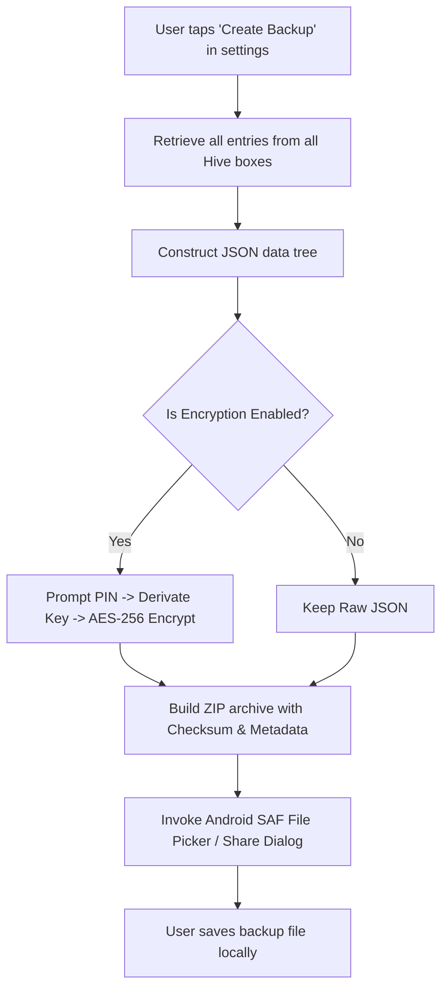

# 2.11 Backup System

**Document ID:** 2.11_Backup_System.md  
**Version:** 1.0  
**Status:** In Progress  
**Owner:** Product Owner  
**Last Updated:** July 2026  

---

## 1. Purpose
The purpose of this document is to specify the structural, functional, and technical requirements for the local **Backup and Restore System (MOD-Settings)** in LifeOS. The backup system ensures the user can securely move their entire database across devices without cloud storage or third-party paid subscriptions.

---

## 2. Objectives
- Enable secure data exports to local device storage.
- Provide robust data restoration logic that prevents corruption or partial imports.
- Implement zero-cost, offline-first transfer methods using native Android share channels.

---

## 3. Scope
This document covers export formats, local storage permissions, recovery flows, encryption schemes, and user workflows. It excludes details of low-level cryptography libraries, which are defined in [21_Security.md](file:///d:/LifeOS/Technical/21_Security.md).

---

## 4. System Requirements

| Requirement ID | Description | Priority | Traceability |
|---|---|---|---|
| **REQ-BACK-001** | The application shall generate a local backup file containing all Hive box records (tasks, logs, settings, journals). | Critical | MOD-Settings |
| **REQ-BACK-002** | The backup file shall support local AES-256 encryption derived from a user-specified security PIN/password. | High | MOD-Settings |
| **REQ-BACK-003** | The application shall trigger the native Android Share sheet / Storage Access Framework (SAF) to let the user save or transfer the backup. | Critical | Platform |
| **REQ-BACK-004** | The import workflow shall validate the backup file format and schema version before overwriting active database boxes. | Critical | MOD-Settings |

---

## 5. Technical Specifications

### 5.1 Export Format
- **Format:** A single Compressed archive (`.zip` or custom extension `.lifeos`) containing:
  - `backup_metadata.json`: Holds export timestamp, schema version, build number, and checksum.
  - `data.json`: An unencrypted or encrypted JSON payload representing all key-value entries grouped by Hive Box name.
- **Naming Convention:** `LifeOS_Backup_YYYYMMDD_HHMMSS.lifeos`

### 5.2 Encryption Mechanism
- **Key Derivation:** Key derived from user's custom recovery password using PBKDF2 with 10,000 iterations.
- **Cipher:** AES-256 in GCM mode (Galois/Counter Mode) to ensure both confidentiality and integrity authentication.

---

## 6. Workflows

### 6.1 Database Export Workflow

### 6.2 Database Import Workflow
1. User selects a `.lifeos` backup file via the Android Storage Access Framework picker.
2. The application reads `backup_metadata.json` and verifies that the checksum matches the file.
3. The system checks the schema version:
   - If the backup schema is *older* than the current app version, run automatic migrations.
   - If the backup schema is *newer*, block the import and display an update error message.
4. If encrypted, prompt the user for the PIN/password to decrypt the payload.
5. If decryption succeeds, perform a safety backup of the active database to a temporary cache.
6. Close all active Hive boxes, overwrite the database files, and reload Hive boxes.
7. Rebuild the Riverpod state tree and refresh the dashboard.

---

## 7. Edge Cases
- **Corrupt File on Import:** If the ZIP archive is corrupted or the checksum validation fails, the app must halt the import immediately, preserve active data, and show a clear corruption warning to the user.
- **Import Fail Mid-Process:** If the app crashes during the database overwrite process, the system must detect this on the next boot (via a state validation flag) and restore the cached safety backup automatically to prevent total data loss.

---

## 8. Dependencies
- **Hive DB Storage Directories:** The storage path on Android.
- **Dart Cryptography Package:** For PBKDF2 and AES-GCM functions.
- **Android Storage Access Framework:** For permissionless document writes.

---

## 9. Open Questions
- **None:** Offline export policies are fully defined.

---

## 10. Acceptance Criteria
- Exporting and immediately importing the resulting file changes nothing on the dashboard and preserves all completion history.
- Attempting to decrypt a backup with an incorrect PIN returns a clean validation error without crashing the application.

---

## 11. Approval Checklist
- [x] Conforms to documentation rules.
- [ ] Reviewed by Product Owner.
- [ ] Locked for changes.

---

## 12. Revision History
| Version | Date | Author | Description |
|---|---|---|---|
| 1.0 | July 13, 2026 | Antigravity | Initial draft of the local backup and recovery system. |