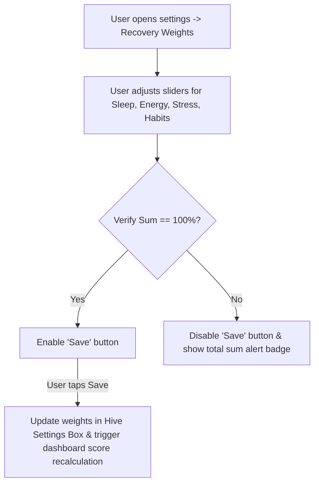

# 2.12 Settings

**Document ID:** 2.12_Settings.md  
**Version:** 1.0  
**Status:** In Progress  
**Owner:** Product Owner  
**Last Updated:** July 2026  

---

## 1. Purpose
The purpose of this document is to define the configuration screens and profile settings managed by **MOD-Settings** in LifeOS. The settings menu grants the user absolute control to customize algorithms, shifts, notifications, and data storage options.

---

## 2. Objectives
- Detail configuration parameters for shift times and target schedules.
- Allow tuning of the daily recovery formula weights.
- Establish boundaries and validation rules for system resets and data operations.

---

## 3. Scope
This document covers the functional specifications of the settings interface and preferences storage. It excludes visual theme layout details (defined in [09_Design_System.md](file:///d:/LifeOS/Design/09_Design_System.md)) and platform notification channel settings (defined in [20_Notification_Engine.md](file:///d:/LifeOS/Technical/20_Notification_Engine.md)).

---

## 4. System Requirements

| Requirement ID | Description | Priority | Traceability |
|---|---|---|---|
| **REQ-SET-001** | The application shall store all user configurations locally in a dedicated Hive settings box. | Critical | MOD-Settings |
| **REQ-SET-002** | The settings UI shall allow customizing shift start times, end times, and target sleep times. | Critical | MOD-Settings |
| **REQ-SET-003** | The settings UI shall support manual adjustments to recovery score weights, validating that the sum equals 100%. | High | MOD-Settings |
| **REQ-SET-004** | The settings screen shall provide options to reset the database, export a backup, or import a backup file. | Critical | MOD-Settings |

---

## 5. Configuration Fields & Defaults

### 5.1 Shift Templates Setup
For each of the four shift templates (Morning Shift, Night Shift, 12-Hour Shift, Off Day), the settings panel allows configuring:
- **Work Window Start/End:** (Time of day, e.g. 10:30 AM – 6:30 PM).
- **Deep Work Target Duration:** (Hours/Minutes, default: 2 hours).
- **Target Sleep Time:** (Time of day, e.g. 11:00 PM).

### 5.2 Recovery Score Weights Customization
Allows customizing the percentage influence of variables in the Recovery Score:
- **Sleep Quality/Duration weight ($W_{sleep}$):** Default = $40\%$.
- **Energy Level weight ($W_{energy}$):** Default = $25\%$.
- **Stress Level weight ($W_{stress}$):** Default = $25\%$.
- **Habit/Activity Checkbox weight ($W_{habits}$):** Default = $10\%$.
- **Validation Rule:** The application must reject save actions if the sum of weights does not equal exactly $100\%$.

### 5.3 Habit Settings
- **Usage Stats App Selector:** Multi-select list of installed packages on the device to monitor screen time (pre-checks: Instagram, YouTube, Chrome, WhatsApp).
- **Unhealthy Habit Ceiling:** Daily limit for quick logs (e.g. daily cigarette limit, default: $10$).

---

## 6. Workflows

### 6.1 Customizing Recovery Weights Workflow

---

## 7. Edge Cases
- **Invalid Shift Intersections:** If the user configures work hours that overlap with their target sleep window (e.g. work hours 8:00 PM – 4:00 AM, sleep target 11:00 PM), the app must show a validation warning card but allow the save (respecting manual override).
- **Complete Factory Reset:** Tapping "Delete All Data" must prompt a double-confirmation modal requiring the user to type "DELETE" before formatting the local Hive database folder and restarting the app.

---

## 8. Dependencies
- **Hive Settings Box:** Persistent local key-value store.
- **MOD-Recovery:** Subscribes to settings to apply user-customized formulas.

---

## 9. Open Questions
- **None:** The configuration structure is fully defined.

---

## 10. Acceptance Criteria
- Adjusting weights recalculates the active day's Recovery Score immediately on the dashboard.
- Factoring reset successfully deletes all logged history and re-instates default templates.

---

## 11. Approval Checklist
- [x] Conforms to documentation rules.
- [ ] Reviewed by Product Owner.
- [ ] Locked for changes.

---

## 12. Revision History
| Version | Date | Author | Description |
|---|---|---|---|
| 1.0 | July 13, 2026 | Antigravity | Initial draft detailing settings panels and default values. |