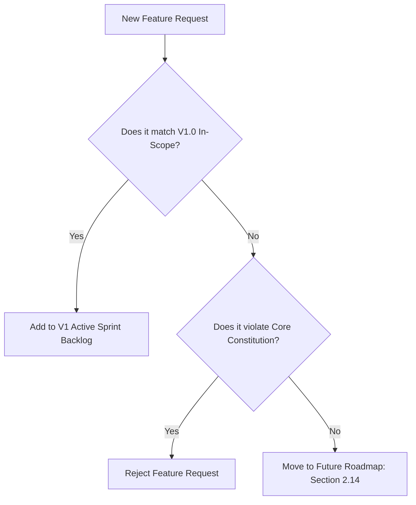

# 2.13 Version 1 Scope

**Document ID:** 2.13_Version1_Scope.md  
**Version:** 1.0  
**Status:** In Progress  
**Owner:** Product Owner  
**Last Updated:** July 2026  

---

## 1. Purpose
The purpose of this document is to define the boundaries of Version 1.0 (MVP) of **LifeOS**. It establishes which features are in-scope for the initial release and which are deferred to future versions, preventing scope creep and ensuring architectural stability.

---

## 2. Objectives
- Establish a strict MVP boundary to focus developer resources.
- Guarantee that all core functions align with the "Zero Monthly Cost" and "Offline-First" principles.
- Document deferred features to maintain a clean product backlog.

---

## 3. Scope
This document applies to all software development lifecycle (SDLC) activities for the Version 1.0 release. It is the final authority on build scope.

---

## 4. System Requirements

| Requirement ID | Description | Priority | Traceability |
|---|---|---|---|
| **REQ-SCOPE-001** | The application build shall exclude any remote login, analytics, or cloud sync components in V1.0. | Critical | Core |
| **REQ-SCOPE-002** | The developer must verify all dependencies utilize 100% free, open-source packages. | Critical | Core |

---

## 5. Scope Matrix

### 5.1 In-Scope for Version 1.0 (MVP)
The following capabilities must be implemented in the initial release:
1. **Core Platform:** Offline-first Flutter app compiled as an Android APK.
2. **Dashboard (MOD-Dashboard):** Main feed containing gauges for recovery state, current task time blocks, quick habit counters, and recommenders.
3. **Shift Manager (MOD-Planner):** Configuration of the 4 shift templates (Morning Shift, Night Shift, 12-Hour Shift, Off Day) with dynamic timetable adjustments.
4. **Task Board (MOD-Tasks):** Local database list split by priority and projects.
5. **Wellness & Recovery (MOD-Sleep, MOD-Recovery):** Manual adaptive recovery logs (sleep, mood, energy, checks) and score generation.
6. **Habits Tracker (MOD-Habits):** Quick log smoking counter and automated Android Usage Stats screen-time tracking.
7. **Project Logs (MOD-Mailing, MOD-CityHost):** Basic time-tracking boards and categorized task splits.
8. **Brain Dump (MOD-BrainDump):** Rapid text processor enabling conversion of text notes into tasks or daily logs.
9. **Backup System (MOD-Settings):** Encrypted local zip exports/imports using native share sheets.

### 5.2 Out-of-Scope for Version 1.0 (Deferred)
The following features are officially deferred to future releases:
- **Version 1.1:** UI aesthetics improvements and additional local analytics charts.
- **Version 2.0:** Google Calendar two-way sync, Health Connect background automation, Voice-to-text journal, and Android Home Screen Widgets.
- **Version 3.0:** Desktop companion app, Cross-device sync, and local offline AI Insights (LLM recommendations).

---

## 6. Workflows

### 6.1 Backlog Grooming Workflow

---

## 7. Edge Cases
- **Health Connect API Changes:** If Health Connect undergoes breaking SDK upgrades during development, the auto-sleep import is disabled and the app falls back to manual recovery check-ins exclusively, to avoid delaying release.

---

## 8. Dependencies
- **Product Constitution:** Defines the non-negotiable product decisions.

---

## 9. Open Questions
- **None:** MVP scope is closed and locked.

---

## 10. Acceptance Criteria
- Codebase contains no references to cloud services (Firebase, Supabase, etc.).
- Build compiles and installs as a standalone APK containing all in-scope features.

---

## 11. Approval Checklist
- [x] Conforms to documentation rules.
- [ ] Reviewed by Product Owner.
- [ ] Locked for changes.

---

## 12. Revision History
| Version | Date | Author | Description |
|---|---|---|---|
| 1.0 | July 13, 2026 | Antigravity | Initial draft establishing the boundaries of the Version 1.0 release. |