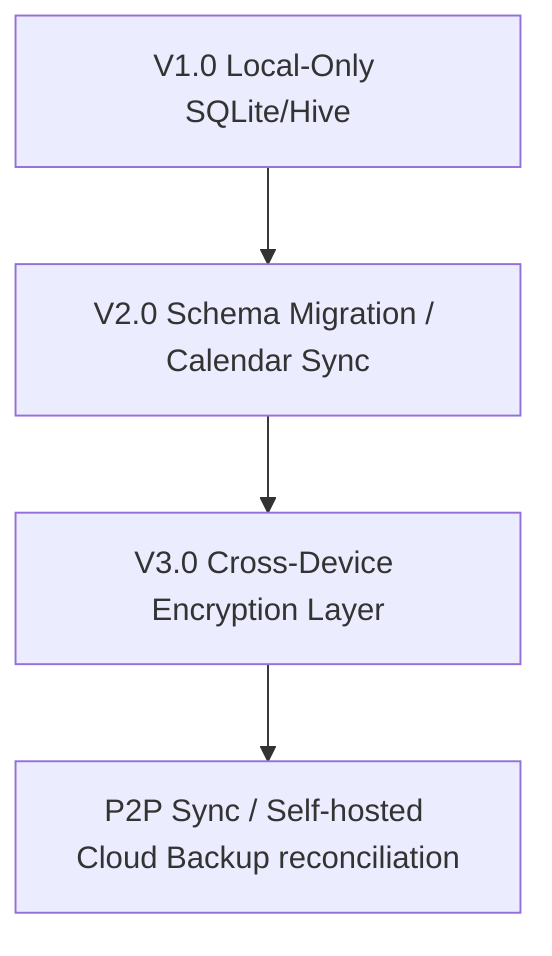

# 2.14 Future Roadmap

**Document ID:** 2.14_Future_Roadmap.md  
**Version:** 1.0  
**Status:** In Progress  
**Owner:** Product Owner  
**Last Updated:** July 2026  

---

## 1. Purpose
The purpose of this document is to outline the long-term vision, scheduled enhancements, and prospective features for **LifeOS** beyond the Version 1.0 release. It serves as a guide for planning future development phases.

---

## 2. Objectives
- Establish a clear sequence of releases (V1.1, V2.0, V3.0) to structure future sprints.
- Detail the technical and functional expectations for upcoming integrations.
- Ensure that future enhancements comply with the offline-first and privacy core principles.

---

## 3. Scope
This document details future feature backlogs and roadmap phases. It is advisory and subject to refinement during subsequent development cycles.

---

## 4. System Requirements

| Requirement ID | Description | Priority | Traceability |
|---|---|---|---|
| **REQ-ROAD-001** | Future sync features (V3.0) must use end-to-end encryption if any cloud buffer is introduced. | Future | Security |
| **REQ-ROAD-002** | Local speech-to-text models (V2.0) must run completely offline without remote API keys. | Future | MOD-Journal |

---

## 5. Roadmap Release Plan

---

### 5.1 Version 1.1 — Polish & Stability
Focuses on optimization, user experience tweaks, and detailed statistics:
- **Aesthetic Refinement:** Implementation of premium layout transitions, dark mode variations, and dynamic card animations.
- **Enhanced Analytics:** Inclusion of multi-variate correlations (e.g. sleep duration vs. smoking counts vs. stress level) and monthly history summaries.
- **Compaction Routines:** Automatic clean-ups of temporary logs to optimize Hive database size.

---

### 5.2 Version 2.0 — Platform Integrations & Widgets
Extends OS-level integrations to reduce user logging friction:
- **Google Calendar Integration:** Two-way sync allowing local calendar events to display in the Daily Planner timetable, and vice-versa.
- **Home Screen Widgets:** Standard Material 3 widgets for:
  - Quick Log (+1 Cigarette, current screen time status).
  - Current task countdown / Timetable.
  - Recovery score gauge.
- **Voice Journal:** Audio journal recorder that transcribes speech to text locally on-device.
- **Automated Health Connect:** Direct automated background syncing of sleep duration, daily steps, active heart rate, and exercise sessions.

---

### 5.3 Version 3.0 — Companion Apps & local AI
Introduces cross-device interactions and smart recommendations:
- **Desktop Companion App:** Stanadalone Flutter desktop app (Windows/macOS) operating on the same local network, syncing database records peer-to-peer.
- **Local AI Insights:** Integrates a small, lightweight offline Language Model (e.g., local LLM running on-device) to analyze historical data logs and provide recommendations.
- **Cross-Device Sync:** End-to-end encrypted synchronization utilizing user-hosted storage (e.g., Nextcloud, WebDAV, or Google Drive) without central servers.

---

## 6. Workflows

### 6.1 Future Migration Workflow

---

## 7. Edge Cases
- **Device Performance on Local AI:** Running local LLMs on low-end Android hardware can lead to memory exhaustion. The AI insight feature must be strictly optional and check device RAM configuration before activation.

---

## 8. Dependencies
- **Platform API Compatibility:** Future features rely on Android API level stability (specifically Android Usage Stats and AlarmManager permissions).

---

## 9. Open Questions
- **None:** The target features align with project planning.

---

## 10. Acceptance Criteria
- Future architectural enhancements do not break backward compatibility with V1.0 local backup files.

---

## 11. Approval Checklist
- [x] Conforms to documentation rules.
- [ ] Reviewed by Product Owner.
- [ ] Locked for changes.

---

## 12. Revision History
| Version | Date | Author | Description |
|---|---|---|---|
| 1.0 | July 13, 2026 | Antigravity | Initial draft of the post-MVP development roadmap. |