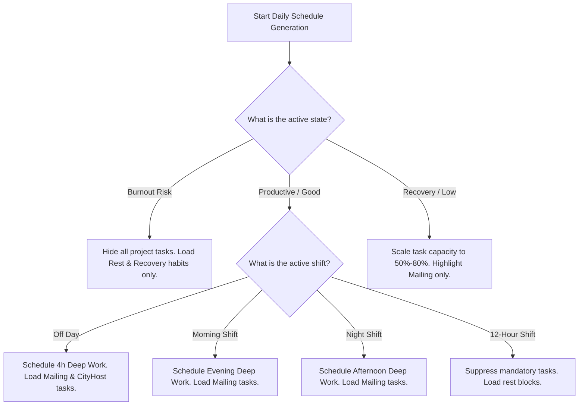

# 2.15 Decision Engine

**Document ID:** 2.15_Decision_Engine.md  
**Version:** 1.0  
**Status:** In Progress  
**Owner:** Product Owner  
**Last Updated:** July 2026  

---

## 1. Purpose
The purpose of this document is to define the logical rules, heuristics, and algorithms that compose the **Decision Engine** (intelligence layer) of LifeOS. It determines task priorities, project schedules, habit emphasis, focus start times, and workload adjustments.

---

## 2. Inputs & Outputs
- **Inputs:**
  - Calculated Recovery Score (0–100) and Recovery State.
  - Active Shift Template (Morning, Night, 12-Hour, Off).
  - Current Project Weekly Hours (Mailing, CityHost).
  - Open Task backlog (tags, priorities, deadlines).
  - Habit consistency logs.
  - Current Local Time.
- **Outputs:**
  - Today's prioritized tasks list.
  - Recommended Deep Work focus session triggers.
  - Suppressed or highlighted habit reminders.
  - Daily Work shutdown trigger time.

---

## 3. Priority Calculation Algorithm

#### RULE-DEC-001: Task Priority Score ($TPS$)
Every task in the active backlog receives a dynamic priority score for today's scheduler:
$$TPS = (BasePriority \times 0.4) + (ProjectWeight \times 0.3) + (ShiftAlignment \times 0.3)$$
Where:
- **BasePriority:** High = 100, Medium = 60, Low = 30.
- **ProjectWeight:** Mailing tasks = 100 (highest), CityHost = 60, general admin/personal = 40.
- **ShiftAlignment:** Tasks aligned with active shift (e.g. shift tasks on workdays) = 100, non-aligned = 40.

---

## 4. Decision Tree

---

## 5. Recommendation Algorithm

### 5.1 Determining Active Focus
1. Query the weekly hours logged for **Mailing** ($H_{mail}$) and **CityHost** ($H_{host}$).
2. If $H_{mail} < 20$ hours (weekly target), designate Mailing as the primary focus project for all upcoming Deep Work slots.
3. If $H_{mail} \ge 20$ hours, shift primary project weight to CityHost tasks.
4. If both targets are met, allocate slots to personal growth or administrative clean-up tasks.

### 5.2 Work Day Shutdown Trigger
- **Morning Shift:** Trigger shutdown alert at 8:30 PM (2 hours after shift ends).
- **Night Shift:** Trigger shutdown alert at 3:30 AM (immediately at shift completion).
- **12-Hour Shift:** Suppress all post-shift task work. Focus exclusively on sleep.

---

## 6. Conflict Resolution & Manual Override

#### RULE-DEC-002: State vs. Shift Precedence
If a user is scheduled for an **Off Day** (highest work capacity template) but the calculated Recovery State is **Burnout Risk** or **Recovery Needed**, the recovery state overrides the shift. The planner will scale capacity down to $0\%$-$50\%$ and suppress deep work, prioritizing the user's health.

#### RULE-DEC-003: Manual Override Authority
The user can manually add, edit, override, or slide any task or focus session. Automatic recommendations serve as advice, never as a constraint.

---

## 7. Dependencies
- **MOD-Recovery:** Supplies Recovery State data.
- **MOD-Planner:** Renders timetable outputs.
- **MOD-Analytics:** Computes target hours progress.

---

## 8. Acceptance Criteria
- Tasks list sorts automatically according to $TPS$ formula.
- Changing shift template recalculates deep work slots in under 50ms.

---

## 9. Revision History
| Version | Date | Author | Description |
|---|---|---|---|
| 1.0 | July 13, 2026 | Antigravity | Initial draft defining decision parameters and algorithms. |
