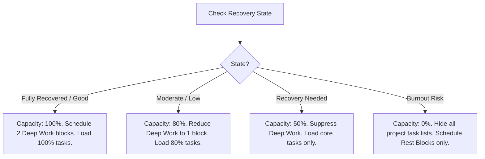

# 2.17 Adaptive Planner

**Document ID:** 2.17_Adaptive_Planner.md  
**Version:** 1.0  
**Status:** In Progress  
**Owner:** Product Owner  
**Last Updated:** July 2026  

---

## 1. Purpose
The purpose of this document is to specify how **MOD-Planner** automatically builds, adapts, and maintains the daily schedule and time-blocked timetable in LifeOS.

---

## 2. Schedule Generation & Time Blocking

### 2.1 Daily Timetable Initializer
Every night at 12:00 AM, or upon manual trigger, the system initializes a 24-hour time block array:
$$T = \{b_0, b_1, \dots, b_{95}\}$$
Where each $b_i$ represents a 15-minute slot.

### 2.2 Template Loading (RULE-PLANNER-002)
The active shift template populates the time array:
- **Work Blocks:** Hard slots blocked out for shift work (e.g. 10:30 AM – 6:30 PM). These blocks are locked from automatic task placements.
- **Deep Work Blocks:** High-productivity focus blocks assigned to project tasks.
- **Rest Blocks:** Reserved blocks for sleep and relaxation.

---

## 3. Recovery & Workload Adaptation

The planner adjusts the active timetable blocks dynamically using the active **Recovery State**:

---

## 4. Automatic Task Placement & Rollover

### 4.1 Auto-Placement Priority
Tasks are auto-allocated to available non-work, non-rest slots based on their priority score ($TPS$):
1. **High-priority Mailing tasks** fill the earliest available Deep Work or focus blocks.
2. **Medium-priority project tasks** occupy general active hours.
3. **Low-priority and Personal tasks** are grouped into a single "Admin Block" at the end of the active day.

### 4.2 Carry-Forward & Overflow Logic (RULE-PLANNER-003)
- **Unfinished Tasks:** Any task scheduled for today that remains unchecked at 11:59 PM is automatically rolled over to the next day's backlog list.
- **Backlog Priority:** Rolled-over tasks receive a $+10$ bump to their base priority score for the next day's scheduling round to prevent starvation.

---

## 5. Auto-Rescheduling & Manual Shifts
- **Late Task Logging:** If a user logs a task late, the planner shifts all remaining non-work task blocks for the day down by 15-minute increments.
- **Manual Lock:** If the user manually edits a slot, that slot is locked. The auto-placement algorithm cannot override locked blocks.

---

## 6. Dependencies
- **MOD-Recovery:** Provides scaling percentages.
- **MOD-Tasks:** Provides task backlog.
- **Hive Planner Box:** Persists timetable states.

---

## 7. Acceptance Criteria
- Planner correctly positions high-priority Mailing tasks before shift work on Morning Shifts.
- Overlapping manual blocks trigger a warning dialog asking to overwrite or slide.

---

## 8. Revision History
| Version | Date | Author | Description |
|---|---|---|---|
| 1.0 | July 13, 2026 | Antigravity | Initial draft detailing schedule generation and adaptation logic. |
