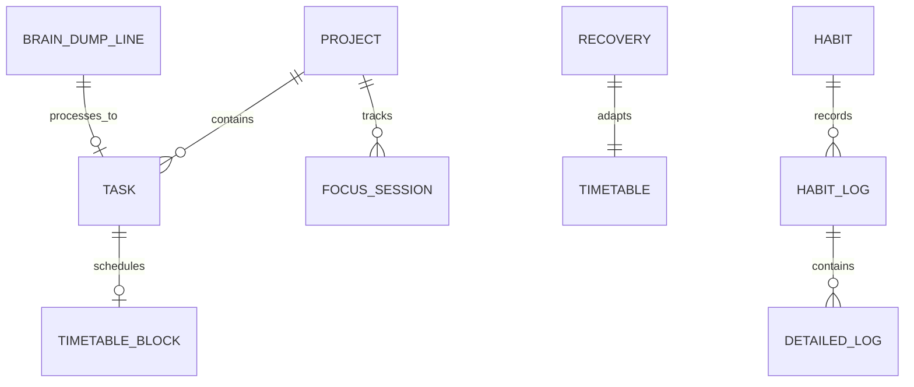

# 2.18 Data Model Overview

**Document ID:** 2.18_Data_Model_Overview.md  
**Version:** 1.0  
**Status:** In Progress  
**Owner:** Product Owner  
**Last Updated:** July 2026  

---

## 1. Purpose
The purpose of this document is to establish the conceptual data models and entity relationships of LifeOS. This overview guides the physical database schema layout without depending on local storage libraries.

---

## 2. Conceptual Data Flow

```text
Projects (Mailing, CityHost)
  ↓ (Has many)
Tasks (High, Medium, Low)
  ↓ (Linked to)
Sessions (Deep Work logs, focus durations)
  ↓ (Correlated with)
Habits & Analytics (Smoking logs, screen times, wellness metrics)
  ↓ (Summarized in)
Dashboard (Consistency, Recovery, and Timetables)
```

---

## 3. Entity Definitions & Relationships

### 3.1 User Configuration (Entity-User)
- Represents the settings and preferences profile of the single local user.
- **Fields:** Shift templates parameters, Custom Recovery Weights, App screen list tracking selection.
- **Relationship:** $1 \to 1$ with Settings Box; $1 \to \text{Many}$ with all logs.

### 3.2 Projects (Entity-Project)
- **Fields:** Project ID, Name (e.g. Mailing, CityHost), Description, Weekly target hours.
- **Relationship:** $1 \to \text{Many}$ with Tasks; $1 \to \text{Many}$ with Focus Sessions.

### 3.3 Tasks (Entity-Task)
- **Fields:** Task ID, Project ID (nullable), Title, Priority Level, Completed Status, Target date, Rollover count.
- **Relationship:** Many $\to 1$ with Project; $1 \to 1$ with Timetable Block.

### 3.4 Focus Sessions (Entity-Session)
- **Fields:** Session ID, Project ID, Start Time, End Time, Completed Duration, Silencing Status.
- **Relationship:** Many $\to 1$ with Project.

### 3.5 Habits (Entity-Habit)
- **Fields:** Habit ID, Name, Target Ceiling.
- **Daily Logs:** Habit Log ID, Date, Total Count.
  - *Smoking Detailed Log:* Timestamp, Trigger, Mood, Notes, Location.
  - *Screen Time Log:* App Package (Instagram, YouTube, Chrome, WhatsApp), Duration (minutes), Date.
- **Relationship:** $1 \to \text{Many}$ daily log entries.

### 3.6 Notes, Journals & Brain Dump (Entity-Note)
- **Fields:** Note ID, Type (Journal, BrainDump), Content Text, Created Timestamp, Processed Status.
- **Relationship:** $1 \to 1$ with Task or Daily Note (upon processing).

### 3.7 Recovery Logs (Entity-Recovery)
- **Fields:** Date, Sleep Start, Sleep End, Night Wake-ups, Sleep Quality, Energy rating, Stress rating, Mood string, Checked activities list, Computed Recovery Score, Computed State.
- **Relationship:** $1 \to 1$ with Daily Timetable.

---

## 4. Entity Relationship Diagram (ERD)



---

## 5. Data Integrity & Overwrite Policies
- **Cascade Deletes:** Deleting a project automatically uncategorizes associated tasks (assigning Project ID = Null) rather than deleting them, preserving user records.
- **One Source of Truth:** Every log entry must utilize UTC absolute timestamps for persistence, and local device time zones for reporting layouts.

---

## 6. Dependencies
- **Hive Database:** Physical layer implementation.

---

## 7. Acceptance Criteria
- Database design document mappings match the relationship definitions defined here.

---

## 8. Revision History
| Version | Date | Author | Description |
|---|---|---|---|
| 1.0 | July 13, 2026 | Antigravity | Initial draft outlining entities, relationships, and data flows. |
