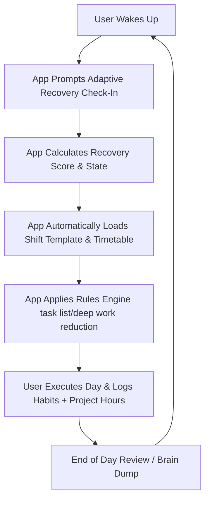

# 2.1 Executive Summary

**Document ID:** 2.1_Executive_Summary.md  
**Version:** 1.0  
**Status:** In Progress  
**Owner:** Product Owner  
**Last Updated:** July 2026  

---

## 1. Purpose
The purpose of **LifeOS** is to serve as an intelligent, adaptive, personal operating system for a single user. It bridges the gap between rigid, disconnected productivity tools (to-do lists, calendar apps, habit trackers, and journals) and the erratic, highly variable lifestyle of rotating shift work. LifeOS continuously adjusts daily schedules, habits, and task recommendations to align with the user's shift cycles and daily recovery state.

---

## 2. Objectives
- **Consolidate Tools:** Eliminate context switching by bringing task management, shift scheduling, habit tracking, project tracking (Mailing, CityHost), recovery planning, focus sessions, and journaling into a single, offline-first dashboard.
- **Reduce Cognitive Load:** Automate daily timetable generation and workload planning, enabling the user to focus entirely on execution.
- **Support Rotating Shifts:** Dynamically shift daily schedules, alarms, habit reminders, and deep work focus blocks according to the active shift template.
- **Prioritize Sustainable Productivity:** Optimize long-term consistency and recovery, protecting against burnout by reducing task volume during low-recovery periods.

---

## 3. Scope
- **In-Scope (Version 1.0):**
  - Offline-first Android application.
  - Four customizable shift templates (Morning Shift, Night Shift, 12-Hour Shift, Off Day).
  - Manual-first Daily Recovery Check-in with adaptive, smart inputs.
  - Quick & detailed logging for healthy and unhealthy habits (e.g., smoking log).
  - Automatic screen time capture using Android Usage Stats API.
  - Feature modules for Mailing (primary project) and CityHost (secondary project).
  - Focus/Deep Work Timer.
  - Encrypted local backup and restore.
- **Out-of-Scope (Version 1.0):**
  - Cloud database syncing or user registration systems.
  - Multi-user support.
  - Two-way external calendar sync (reserved for V2.0).
  - AI insight generator or LLM integrations (reserved for V3.0).

---

## 4. Workflows

### 4.1 High-Level Daily Lifecycle Workflow

---

## 5. Edge Cases
- **Shift Changes Mid-Day:** If a user changes their shift template mid-day, the app must automatically recalculate notifications, timetables, and task list layouts without destroying already logged data for that day.
- **No Daily Check-In Completed:** If the user misses the daily recovery check-in, the system must fallback to a default "Good Recovery" template based on historic averages, without halting app features.
- **App Killed / Background Lifecycle:** Android OS aggressively killing background database writes. The application must save draft logs instantly to Hive to prevent data loss.

---

## 6. Dependencies
- **Platform Dependencies:** Android OS (specifically SDK version support for Background Services, Usage Stats API, and Health Connect).
- **Core Library Dependencies:** Hive (local storage), Riverpod (state management), Flutter framework.
- **Upstream Documents:** [00_Product_Constitution.md](file:///d:/LifeOS/Foundation/00_Product_Constitution.md), [01_Product_Vision.md](file:///d:/LifeOS/Foundation/01_Product_Vision.md).

---

## 7. Open Questions
- **None:** All primary scope boundaries have been resolved in the approved implementation plan.

---

## 8. Acceptance Criteria
- The dashboard successfully loads within less than 2 seconds under cold start.
- The document conforms to all 15 Core Principles of the Product Constitution.
- No network requests are made by the application during initialization.

---

## 9. Approval Checklist
- [x] Conforms to documentation rules.
- [ ] Reviewed by Product Owner.
- [ ] Locked for changes.

---

## 10. Revision History
| Version | Date | Author | Description |
|---|---|---|---|
| 1.0 | July 13, 2026 | Antigravity | Initial draft of the Executive Summary matching user-approved constraints. |