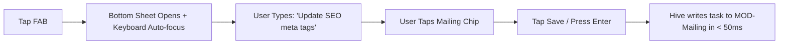

# 2.20 Search and Quick Actions

**Document ID:** 2.20_Search_and_Quick_Actions.md  
**Version:** 1.0  
**Status:** In Progress  
**Owner:** Product Owner  
**Last Updated:** July 2026  

---

## 1. Purpose
The purpose of this document is to define the interface properties and input controls for **Global Search** and **Quick Actions** in LifeOS. These interactions minimize tap friction and cognitive load, enabling rapid input entry in under 3 seconds.

---

## 2. Objectives
- Establish a zero-friction overlay for capturing tasks, notes, habits, and shift templates.
- Define a unified local search system index covering historical logs, projects, and notes.
- Enforce the "Less Than Three Taps" constitution rule for frequent user actions.

---

## 3. Scope
This document covers the UI hooks, quick actions sheet, and search behaviors in Version 1.0. It excludes database indexing schemes, which are detailed in [13_Database_Design.md](file:///d:/LifeOS/Technical/13_Database_Design.md).

---

## 4. System Requirements

| Requirement ID | Description | Priority | Traceability |
|---|---|---|---|
| **REQ-QUICK-001** | The application shall display a Floating Action Button (FAB) or a persistent bottom sheet for "Quick Actions" on the dashboard. | Critical | MOD-Dashboard |
| **REQ-QUICK-002** | The "Quick Actions" overlay shall support creating tasks, logging habits, writing brain dumps, or changing shifts in under 3 taps. | Critical | MOD-Dashboard |
| **REQ-QUICK-003** | The application shall support searching across all tasks, project details, and daily journal logs. | High | MOD-Dashboard |

---

## 5. Quick Actions Specifications

### 5.1 Quick Add Task Overlay
- **Trigger:** Tap FAB $\to$ choose "Add Task" (or swipe gesture).
- **Controls:** A simple bottom sheet text field.
- **Rules:**
  - `RULE-QUICK-001`: Typing a task and tapping enter saves it to the "Personal" backlog by default.
  - Quick-chips allow one-tap assignment to Mailing or CityHost project boards.

### 5.2 Quick Habit Increment (Cigarette Log)
- **Trigger:** One tap on the dashboard "+1" icon.
- **Rules:**
  - `RULE-QUICK-002`: Write log immediately to database with current timestamp.
  - Long press on "+1" launches the Detailed Log form (Trigger, Mood selection).

### 5.3 Quick Brain Dump Entry
- **Trigger:** Tap "Brain Dump" shortcut on dashboard.
- **Controls:** Large text input box with auto-focus keyboard. Saves raw multi-line strings instantly.

### 5.4 Quick Shift Override
- **Trigger:** Header shift indicator tap.
- **Controls:** Bottom sheet listing the 4 templates. Selecting a template reloads the active day's timetable.

---

## 6. Global Search Specifications
- **Search Scope:** Matches query strings against Task Titles, Project Names, Daily Journal review text, and Brain Dump logs.
- **Search Logic:** Runs local database query using substring matches:
  - Match is case-insensitive.
  - Results group by Category (e.g. Tasks, Journals, Projects).
- **Performance Budget:** Search results must update dynamically as the user types, completing query sweeps in under 50ms locally.

---

## 7. Workflows

### 7.1 Quick Task Capture Workflow

---

## 8. Edge Cases
- **Duplicate Searches:** If query execution is faster than typing speed, cancel current search stream and run the newest string to prevent UI lag.
- **Empty States:** If no search matches are found, display a clean placeholder card suggesting quick actions (e.g., "No matches. Create task?").

---

## 9. Dependencies
- **MOD-Tasks & MOD-Journal:** Provides data fields.
- **Hive Database Indexes:** To query strings quickly.

---

## 10. Acceptance Criteria
- Global search matches historical records immediately without crashing the application.
- Tapping quick shift changes updates planner blocks in under 50ms.

---

## 11. Revision History
| Version | Date | Author | Description |
|---|---|---|---|
| 1.0 | July 13, 2026 | Antigravity | Initial draft defining quick capture sheets and global search behaviors. |
