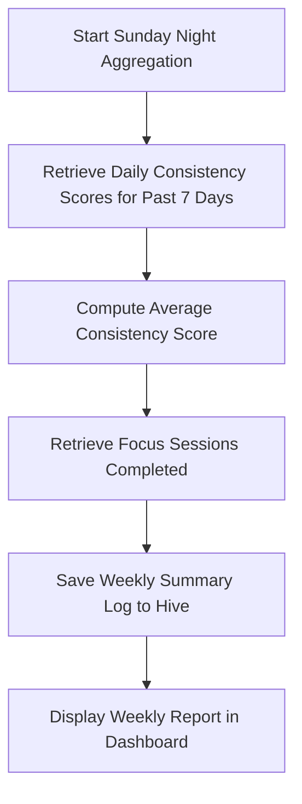

# 2.2 Product Goals

**Document ID:** 2.2_Product_Goals.md  
**Version:** 1.0  
**Status:** In Progress  
**Owner:** Product Owner  
**Last Updated:** July 2026  

---

## 1. Purpose
The purpose of this document is to specify the quantitative and qualitative goals of **LifeOS** and detail the calculations for its key performance metrics. These goals drive the feature priorities and define the success criteria of the product over its operational lifecycle.

---

## 2. Objectives
- **Short-Term (0–3 Months):** Enable frictionless daily logging (<30 seconds) and consistent routine shifting. 
- **Medium-Term (3–12 Months):** Identify correlations (e.g., Sleep Quality vs. Smoking Habits) to help the user make conscious behavioral modifications.
- **Long-Term (12+ Months):** Achieve a multi-year dashboard of clean, local data that enables high-level retrospectives without bloating local app memory.

---

## 3. Scope
This document covers the definition, tracking, and local calculation formulas for product goals and metrics. It excludes any remote analytical tracking or cloud-based user metrics, adhering strictly to the privacy-first local architecture.

---

## 4. Requirements

| Requirement ID | Description | Priority | Traceability |
|---|---|---|---|
| **REQ-GOAL-001** | The application shall calculate a daily **Consistency Score** (0–100) based on task completion and habit adherence. | Critical | MOD-Analytics |
| **REQ-GOAL-002** | The application shall calculate a weekly **Focus Score** based on Deep Work hours completed versus targets. | High | MOD-Analytics |
| **REQ-GOAL-003** | The application shall calculate a **Recovery Index** using sleep and wellness variables. | Critical | MOD-Recovery |
| **REQ-GOAL-004** | All calculations must run locally on-device in under 50ms. | Critical | MOD-Analytics |

### 4.1 Business Rules

#### RULE-GOAL-001: Daily Consistency Score Formula
The Daily Consistency Score ($CS_{day}$) is calculated out of 100 points:
$$CS_{day} = (W_{tasks} \times TaskCompletionRate) + (W_{habits} \times HabitCompletionRate)$$
Where:
- $W_{tasks} = 60\%$ (Weight of daily planner tasks)
- $W_{habits} = 40\%$ (Weight of tracked habits)
- If a day is marked as a *12-Hour Shift* or *Burnout Risk*, the formula adapts (reducing mandatory tasks to zero, habit weighting changes to $100\%$ of completed core habits).

#### RULE-GOAL-002: Weekly Review Target
- **Target:** Maintain a weekly average Consistency Score of $\ge 80\%$.
- The weekly score must be saved to the database on Sundays at 11:59 PM.

---

## 5. Workflows

### 5.1 Weekly Aggregate Calculation Workflow

---

## 6. Edge Cases
- **Incomplete Days:** If the user completely forgets to open the application for a calendar day, the Consistency Score for that day is calculated as $0$, but the app must allow the user to backfill tasks and habits for up to 3 days.
- **Clock Drifts / Timezone Shifts:** When traveling across timezones, the daily scores must lock based on the local time zones when the day was completed, avoiding retroactively modifying previous days.

---

## 7. Dependencies
- **MOD-Analytics:** To process, aggregate, and store calculated values.
- **MOD-Recovery:** To supply recovery states that dynamically scale daily targets.

---

## 8. Open Questions
- **None:** The target metrics have been aligned with the manual check-in parameters.

---

## 9. Acceptance Criteria
- Daily Consistency Score matches the mathematical formula exactly when verified via unit tests.
- Backlogged days can be successfully edited, prompting a recalculation of the respective daily and weekly scores.

---

## 10. Approval Checklist
- [x] Conforms to documentation rules.
- [ ] Reviewed by Product Owner.
- [ ] Locked for changes.

---

## 11. Revision History
| Version | Date | Author | Description |
|---|---|---|---|
| 1.0 | July 13, 2026 | Antigravity | Initial draft of the Product Goals and Metric Specifications. |