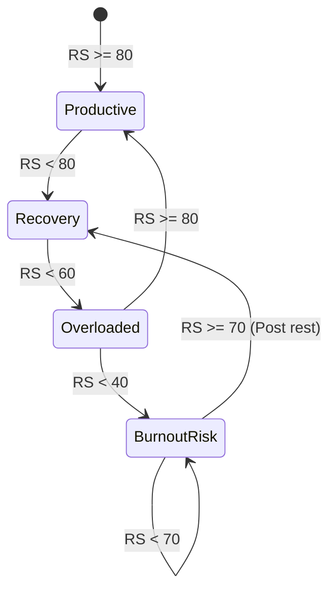

# 2.4 User States

**Document ID:** 2.4_User_States.md  
**Version:** 1.0  
**Status:** In Progress  
**Owner:** Product Owner  
**Last Updated:** July 2026  

---

## 1. Purpose
The purpose of this document is to define the four core **User States** (Productive, Recovery, Overloaded, Burnout Risk) and specify the formulas and transition rules that govern how the application automatically assigns states based on daily inputs.

---

## 2. Objectives
- Establish an automated, manual-first calculation engine for the user's recovery score.
- Specify how the daily state modifies schedule recommendations, task prioritization, and notifications.
- Define transition rules to proactively protect the user from physical and mental exhaustion.

---

## 3. Scope
This document details the recovery metrics, states, transition logic, and rules. It does not cover specific database schemas or UI layouts, which are covered in [13_Database_Design.md](file:///d:/LifeOS/Technical/13_Database_Design.md) and [08_UI_UX_Specification.md](file:///d:/LifeOS/Design/08_UI_UX_Specification.md).

---

## 4. Requirements

| Requirement ID | Description | Priority | Traceability |
|---|---|---|---|
| **REQ-STATE-001** | The application shall calculate a daily **Recovery Score** (0–100) using Sleep, Energy, Stress, and Shift Type. | Critical | MOD-Recovery |
| **REQ-STATE-002** | The application shall determine one of the four **User States** based on the Recovery Score and historical trends. | Critical | MOD-Recovery |
| **REQ-STATE-003** | The daily planner must automatically reduce the number of active tasks based on the active User State. | High | MOD-Planner |
| **REQ-STATE-004** | The application must allow the user to manually override the calculated state at any time. | Critical | MOD-Dashboard |

---

## 5. Workflows and Rules

### 5.1 Recovery Score Calculation Algorithm
The Recovery Score ($RS$, scale 0–100) is calculated upon daily check-in completion. 

#### RULE-RECOVERY-001: Component Weightings
- **Sleep Component ($S$, 40% weight):**
  - Sleep Duration ($SD$ in hours) = $(\text{Wake Time} - \text{Start Time}) - (\text{Wake-ups} \times 0.25)$
  - Duration Score ($DS$): 
    - $SD \ge 8 \rightarrow 100$
    - $7 \le SD < 8 \rightarrow 85$
    - $6 \le SD < 7 \rightarrow 65$
    - $SD < 6 \rightarrow 40$
  - Quality Score ($QS$): Excellent = 100, Good = 80, Average = 60, Poor = 30.
  - $S = (DS \times 0.6) + (QS \times 0.4)$
- **Energy Component ($E$, 25% weight):**
  - $E = \text{Energy Rating (1-10)} \times 10$
- **Stress Component ($St$, 25% weight):**
  - $St = (11 - \text{Stress Rating (1-10)}) \times 10$
- **Habit/Activity Component ($H$, 10% weight):**
  - Score based on completed checkboxes (Walk, Exercise, Stretching, Protein, Water, Brain Dump, Journal, Meditation, Relaxation). Calculated as:
    $$H = \left( \frac{\text{Completed Checkboxes}}{\text{Total Checkboxes Tracked}} \right) \times 100$$
- **Shift Penalty/Bonus ($SP$):**
  - Off Day: $+5$
  - Night Shift: $-10$
  - 12-Hour Shift: $-15$

#### RULE-RECOVERY-002: Final Formula
$$RS = \max\Big(0, \min\big(100, (S \times 0.40) + (E \times 0.25) + (St \times 0.25) + (H \times 0.10) + SP\big)\Big)$$

---

### 5.2 User States & Adaptive Behavior

Based on the calculated Recovery Score ($RS$), the application assigns one of the following states:

| Recovery State | Score Range | Schedule Impact | Task Priorities |
|---|---|---|---|
| **Productive** | $80 \le RS \le 100$ | 100% schedule capacity loaded. | Standard priority. Full project deep work suggested. |
| **Recovery** | $60 \le RS < 80$ | 80% capacity. Optional tasks hidden. | Suggests low-intensity tasks (e.g., admin, reading). |
| **Overloaded** | $40 \le RS < 60$ | 50% capacity. Suppress non-essential habit alarms. | Suppress secondary tasks; highlight primary (Mailing) only. |
| **Burnout Risk** | $RS < 40$ | "Mandatory Rest Day." 0% project tasks loaded. | Suggest recovery activities (Water, Walk, Sleep). |

#### RULE-RECOVERY-003: Burnout Risk Escalation Rule
If the Recovery Score is $RS < 50$ for three consecutive days, the state is automatically locked to **Burnout Risk** regardless of the current day's calculated score, until a recovery check-in yields a score of $\ge 70$.

---

### 5.3 Transition State Diagram

---

## 6. Edge Cases
- **Missing Check-in:** If no check-in is logged by 12:00 PM, the application checks if a walk was completed or if phone usage is high. It assumes a "Recovery" state to prevent over-scheduling until input is entered.
- **Adaptive Check-In Logic:** The check-in form only shows inputs not yet known. If a walk is auto-logged via Health Connect, the walk question is hidden. If sleep is imported via wearable, the sleep inputs are pre-populated and require only quality selection.

---

## 7. Dependencies
- **MOD-Sleep:** Provides Sleep duration and quality inputs.
- **MOD-Planner:** Subscribes to the active state to resize the daily timeline.
- **MOD-Settings:** Defines custom weights for the recovery formula components.

---

## 8. Open Questions
- **None:** Transition thresholds have been verified.

---

## 9. Acceptance Criteria
- Unit tests verify that a series of consecutive poor sleep inputs triggers the Burnout Risk state.
- Daily planner tasks scale down accurately (e.g. from 10 to 5 tasks) when state changes to Overloaded.

---

## 10. Approval Checklist
- [x] Conforms to documentation rules.
- [ ] Reviewed by Product Owner.
- [ ] Locked for changes.

---

## 11. Revision History
| Version | Date | Author | Description |
|---|---|---|---|
| 1.0 | July 13, 2026 | Antigravity | Initial draft defining user states, formulas, and adaptation rules. |