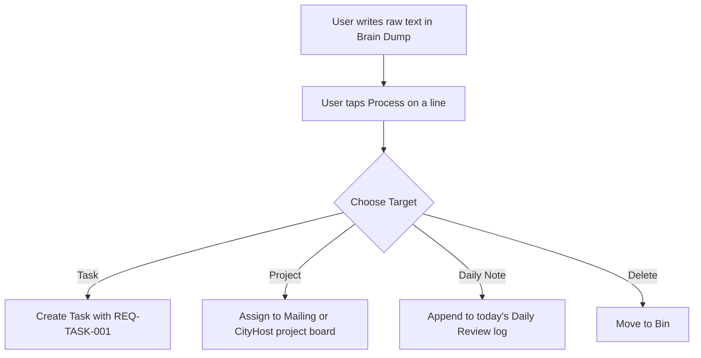

# 2.5 Functional Requirements

**Document ID:** 2.5_Functional_Requirements.md  
**Version:** 1.0  
**Status:** In Progress  
**Owner:** Product Owner  
**Last Updated:** July 2026  

---

## 1. Purpose
The purpose of this document is to specify the detailed functional requirements of **LifeOS**, organized by module. Each requirement is assigned a unique ID to ensure traceability across development phases.

---

## 2. Objectives
- Detail the functional scope of Version 1.0 for each of the 12 core modules.
- Ensure clear mappings between system features, user actions, and business rules.
- Set functional parameters for offline operations and automated triggers.

---

## 3. Scope
This document outlines functional requirements for the core modules. It does not define low-level coding implementations or design specifications, which are located in the [Technical/](file:///d:/LifeOS/Technical/) and [Design/](file:///d:/LifeOS/Design/) directories respectively.

---

## 4. System Requirements

### 4.1 Dashboard Module (MOD-Dashboard)
The dashboard is the central command center of LifeOS.

| Requirement ID | Description | Priority | Traceability |
|---|---|---|---|
| **REQ-DASH-001** | The application shall show the active shift template and current task on the dashboard. | Critical | MOD-Dashboard |
| **REQ-DASH-002** | The dashboard shall display a visual gauge showing the computed Recovery State and Recovery Score. | Critical | MOD-Dashboard |
| **REQ-DASH-003** | The dashboard shall include a "Quick Log" button for smoking (+1 Cigarette) requiring only one tap. | High | MOD-Dashboard |
| **REQ-DASH-004** | The dashboard shall display a "Daily Planner" component showing the today's adaptive timeline. | Critical | MOD-Planner |
| **REQ-DASH-005** | The dashboard shall display a "Smart Recovery Recommendation" card based on the computed User State. | High | MOD-Recovery |

### 4.2 Planner Module (MOD-Planner)
Handles the adaptive scheduling and shift templates.

| Requirement ID | Description | Priority | Traceability |
|---|---|---|---|
| **REQ-PLAN-001** | The application shall load one of four shift templates: **Morning Shift**, **Night Shift**, **12-Hour Shift**, or **Off Day**. | Critical | RULE-SHIFT-001 |
| **REQ-PLAN-002** | The daily planner shall adaptively adjust task scheduling times and priority based on the loaded shift template. | Critical | RULE-PLANNER-001 |
| **REQ-PLAN-003** | The planner shall allow manual editing, moving, or resizing of any block on the daily timetable. | High | RULE-PLANNER-001 |
| **REQ-PLAN-004** | The planner shall automatically suppress tasks and schedule rest hours if the Recovery State is **Burnout Risk**. | Critical | RULE-RECOVERY-003 |

### 4.3 Task Module (MOD-Tasks)
Task lists linked to projects and daily planning.

| Requirement ID | Description | Priority | Traceability |
|---|---|---|---|
| **REQ-TASK-001** | Tasks shall support categorization under standard lists (Personal, Admin) or projects (Mailing, CityHost). | High | MOD-Tasks |
| **REQ-TASK-002** | Tasks shall support three priority levels: High, Medium, and Low. | High | MOD-Tasks |
| **REQ-TASK-003** | Checking off a task shall trigger a recalculation of the Daily Consistency Score instantly. | Critical | RULE-GOAL-001 |

### 4.4 Habit Module (MOD-Habits)
Tracks smoking, screen time, and positive routines.

| Requirement ID | Description | Priority | Traceability |
|---|---|---|---|
| **REQ-HABIT-001** | The habit tracker shall support "Quick Logging" (+1 count) and "Detailed Logging" (Time, Trigger, Mood, Notes). | High | MOD-Habits |
| **REQ-HABIT-002** | The application shall automatically query total screen time and app usage duration for selected apps (Instagram, YouTube, Chrome, WhatsApp) via the Android Usage Stats API. | High | MOD-Habits |
| **REQ-HABIT-003** | The application shall support manual entry or manual override of screen time metrics. | Critical | MOD-Habits |

### 4.5 Mailing Module (MOD-Mailing)
Tracks tasks and hours for the primary professional project.

| Requirement ID | Description | Priority | Traceability |
|---|---|---|---|
| **REQ-PROJECT-001** | The Mailing module shall track total hours worked, task lists, and progress against a weekly hour target. | Critical | MOD-Mailing |
| **REQ-PROJECT-002** | The Mailing module shall support categorizing tasks into sub-disciplines: SEO, Web Development, Content, Research, and Documentation. | High | MOD-Mailing |

### 4.6 CityHost Module (MOD-CityHost)
Tracks tasks and events for the secondary community project.

| Requirement ID | Description | Priority | Traceability |
|---|---|---|---|
| **REQ-PROJECT-003** | The CityHost module shall track campaigns, upcoming events, creative design tasks, and hours worked. | High | MOD-CityHost |
| **REQ-PROJECT-004** | The CityHost module shall display a chronological log of events with completed status. | High | MOD-CityHost |

### 4.7 Sleep & Recovery Modules (MOD-Sleep, MOD-Recovery)
Calculates physical and mental readiness.

| Requirement ID | Description | Priority | Traceability |
|---|---|---|---|
| **REQ-SLEEP-001** | The application shall prompt a Daily Recovery Check-in that only asks for missing data (adaptive form). | High | RULE-RECOVERY-001 |
| **REQ-SLEEP-002** | If Health Connect or Android Health APIs are active, the application shall auto-import Sleep Duration and Sleep Start/Wake times. | High | MOD-Sleep |
| **REQ-SLEEP-003** | The application shall calculate the Recovery Score and assign the corresponding Recovery State. | Critical | RULE-RECOVERY-002 |

### 4.8 Analytics Module (MOD-Analytics)
Processes logs locally to display trends.

| Requirement ID | Description | Priority | Traceability |
|---|---|---|---|
| **REQ-ANALYTICS-001** | The application shall display local charts of Daily Consistency Scores over Weekly and Monthly periods. | Critical | MOD-Analytics |
| **REQ-ANALYTICS-002** | The application shall display local correlation graphs between variables (e.g., Stress Level vs. Cigarettes Logged). | High | MOD-Analytics |

### 4.9 Notifications Module (MOD-Notifications)
Handles localized reminders and alarms.

| Requirement ID | Description | Priority | Traceability |
|---|---|---|---|
| **REQ-NOTIFICATION-001** | The application shall schedule local push notifications for task alarms, habit reminders, and recovery checks. | Critical | MOD-Notifications |
| **REQ-NOTIFICATION-002** | Notifications shall be suppressed automatically if the user is in Deep Work focus mode or sleeping. | High | RULE-PLANNER-001 |

### 4.10 Journal & Brain Dump Modules (MOD-Journal, MOD-BrainDump)
Allows text input capture and rapid processing.

| Requirement ID | Description | Priority | Traceability |
|---|---|---|---|
| **REQ-NOTE-001** | The application shall support text Brain Dumps. | Critical | MOD-BrainDump |
| **REQ-NOTE-002** | The Brain Dump module shall allow one-tap conversion of a note line into a Task, a Project item, or a Daily Note. | High | MOD-BrainDump |
| **REQ-NOTE-003** | The application shall support a simple text Journal module for end-of-day reviews. | High | MOD-Journal |

### 4.11 Settings Module (MOD-Settings)
Backup and custom configuration profiles.

| Requirement ID | Description | Priority | Traceability |
|---|---|---|---|
| **REQ-SET-001** | The application shall support full data export to an encrypted local JSON/SQLite file. | Critical | MOD-Settings |
| **REQ-SET-002** | The application shall support database recovery via importing an exported backup file. | Critical | MOD-Settings |

---

## 5. Workflows

### 5.1 Brain Dump Processing Workflow

---

## 6. Edge Cases
- **Usage Stats API Permission Denied:** If the user denies permission to Android Usage Stats, the app must hide the auto-import widgets in the habit tracker and default to prompting for manual input of Screen Time, without throwing runtime exceptions.
- **Multiple Timezone Crossings:** Backlogged habits must write to the database using the absolute timestamp of the event, but display using the relative calendar date on which they occurred.

---

## 7. Dependencies
- **Android OS Health Connect:** Required for automated sleep capture.
- **Android UsageStatsManager:** Required for automated screen time calculations.
- **Hive Database:** Local data persistence driver.

---

## 8. Open Questions
- **None:** The requirements mapping matches approved architecture decisions.

---

## 9. Acceptance Criteria
- App passes functional tests for shift template modifications (changing templates immediately shifts the notification alarm registers).
- Data exports and imports preserve all historic record counts exactly.

---

## 10. Approval Checklist
- [x] Conforms to documentation rules.
- [ ] Reviewed by Product Owner.
- [ ] Locked for changes.

---

## 11. Revision History
| Version | Date | Author | Description |
|---|---|---|---|
| 1.0 | July 13, 2026 | Antigravity | Initial draft of the functional requirements. |