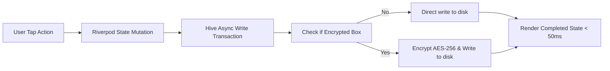

# 2.6 Non-Functional Requirements

**Document ID:** 2.6_Non_Functional_Requirements.md  
**Version:** 1.0  
**Status:** In Progress  
**Owner:** Product Owner  
**Last Updated:** July 2026  

---

## 1. Purpose
The purpose of this document is to define the non-functional requirements (NFRs) of **LifeOS**, establishing benchmarks for performance, reliability, security, hardware footprint, and offline functionality.

---

## 2. Objectives
- Ensure the application operates entirely locally with zero external server dependencies.
- Define response latency budgets for local database operations and screen rendering.
- Mitigate resource drain (battery, storage) on the target Android hardware.

---

## 3. Scope
This document specifies non-functional boundaries and performance constraints. It applies to all UI components, database adapters, and hardware integration channels in Version 1.0.

---

## 4. System Requirements

### 4.1 Performance & Latency (REQ-NFR-PERF)

| Requirement ID | Description | Target | Traceability |
|---|---|---|---|
| **REQ-NFR-001** | The application **Cold Start** time (from icon tap to responsive dashboard) shall be less than 2.0 seconds. | $\le 2.0$s | Platform |
| **REQ-NFR-002** | Local Database Read operations for current day configuration shall execute in less than 50 milliseconds. | $\le 50$ms | Hive DB |
| **REQ-NFR-003** | Local Database Write transactions (saves, updates, checks) shall complete in less than 50 milliseconds. | $\le 50$ms | Hive DB |
| **REQ-NFR-004** | Frame rendering rate during layout transitions and scroll events shall maintain a minimum of 60 frames per second. | $\ge 60$fps | UI Engine |

### 4.2 Data Ownership & Offline-First (REQ-NFR-DATA)

| Requirement ID | Description | Target | Traceability |
|---|---|---|---|
| **REQ-NFR-005** | The application must work 100% offline. No internet connection shall be required for core modules. | 100% Offline | Core |
| **REQ-NFR-006** | All user data must be stored locally on the device's internal application storage. | Local-Only | Hive DB |
| **REQ-NFR-007** | The system must not include any default telemetry, analytics SDKs, or cloud synchronization loops. | Zero Analytics | Core |

### 4.3 Efficiency & Footprint (REQ-NFR-EFF)

| Requirement ID | Description | Target | Traceability |
|---|---|---|---|
| **REQ-NFR-008** | The final compiled Android Application Package (APK) size must be less than 50 Megabytes. | $< 50$MB | Build |
| **REQ-NFR-009** | Background battery utilization shall be minimal, avoiding continuous running wake-locks. | Minimal | Platform |

### 4.4 Security & Privacy (REQ-NFR-SEC)

| Requirement ID | Description | Target | Traceability |
|---|---|---|---|
| **REQ-NFR-010** | The database must support localized encryption using AES-256 for sensitive Hive boxes (e.g. journal entries). | Encrypted | Hive DB |
| **REQ-NFR-011** | The application shall support optional Android biometric (fingerprint/face) or PIN validation on launch. | Optional | Platform |

---

## 5. Workflows

### 5.1 Local Transaction Pipeline

---

## 6. Edge Cases
- **Low Disk Space:** If the device's storage is critically low ($< 100\text{MB}$), the app must trigger auto-compaction on Hive boxes and notify the user via a dashboard warning card before executing any new writes.
- **Android OS App Standby / Doze Mode:** The OS putting the app to sleep. Alarms and notifications must use `setExactAndAllowWhileIdle` via Android AlarmManager to guarantee delivery.

---

## 7. Dependencies
- **Dart AES Ciphers:** For local file encryption.
- **Android AlarmManager API:** For exact, offline alarm triggers.
- **Android OS Storage Services:** To check available memory.

---

## 8. Open Questions
- **None:** The target benchmarks have been aligned.

---

## 9. Acceptance Criteria
- Profile build testing registers database read/write latencies consistently below 50ms.
- Running the APK through static analysis verifies zero tracking, networking, or advertisement dependencies.

---

## 10. Approval Checklist
- [x] Conforms to documentation rules.
- [ ] Reviewed by Product Owner.
- [ ] Locked for changes.

---

## 11. Revision History
| Version | Date | Author | Description |
|---|---|---|---|
| 1.0 | July 13, 2026 | Antigravity | Initial draft of the non-functional requirements. |