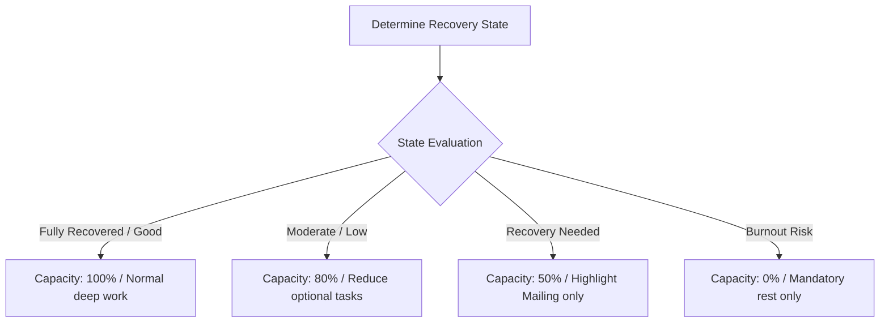

# 2.8 Rules Engine

**Document ID:** 2.8_Rules_Engine.md  
**Version:** 1.0  
**Status:** In Progress  
**Owner:** Product Owner  
**Last Updated:** July 2026  

---

## 1. Purpose
The purpose of this document is to specify the logical rules, mathematical models, and operational triggers that compose the **Rules Engine (MOD-Recovery)** in LifeOS. The Rules Engine adaptively orchestrates timetables, notification reminders, task visibility, and project priority thresholds.

---

## 2. Objectives
- Codify scheduling rules for the four main shift templates.
- Define adaptive workload scaling based on computed Recovery States.
- Specify conflict-resolution rules for overlapping user priorities.

---

## 3. Scope
This document specifies the rule sets (RULE-SHIFT, RULE-RECOVERY, RULE-PLANNER, RULE-DASHBOARD, and RULE-PROJECT) and their evaluation pipelines. It excludes the coding language structure which is detailed in [18_Shift_Engine.md](file:///d:/LifeOS/Technical/18_Shift_Engine.md) and [19_Recovery_Engine.md](file:///d:/LifeOS/Technical/19_Recovery_Engine.md).

---

## 4. System Requirements

| Requirement ID | Description | Priority | Traceability |
|---|---|---|---|
| **REQ-RULES-001** | The application shall evaluate active rules instantly upon user login, shift change, or recovery logging. | Critical | MOD-Recovery |
| **REQ-RULES-002** | The application shall maintain a persistent log of active states calculated by rules. | Critical | Hive DB |

---

## 5. Master Rule Definitions

---

### 5.1 Shift Scheduling Rules (RULE-SHIFT)

#### RULE-SHIFT-001: Shift Timetable Initializer
Upon selecting a shift template for the day, the system automatically loads the corresponding timeblocks and target windows:

| Shift Template | Working Hours | Primary Focus | Deep Work Block | Sleep Target |
|---|---|---|---|---|
| **Morning Shift** | 10:30 AM – 6:30 PM | Shift + Mailing | Evening (7:30 PM – 9:30 PM) | 11:00 PM |
| **Night Shift** | 7:30 PM – 3:30 AM | Mailing before shift | Afternoon (1:00 PM – 4:00 PM) | 4:00 AM (Post-shift) |
| **12-Hour Shift** | 12:00 PM – 12:00 AM | None (Recovery Focus) | None (Suppressed) | 12:30 AM |
| **Off Day** | None | Mailing + CityHost | Extended (9:00 AM – 1:00 PM) | 11:00 PM |

---

### 5.2 Recovery Rules (RULE-RECOVERY)

#### RULE-RECOVERY-001: Daily Recovery Check-in Calculation
The daily Recovery Score ($RS$) is calculated as follows:
$$RS = \max\Big(0, \min\big(100, (S \times 0.40) + (E \times 0.25) + (St \times 0.25) + (H \times 0.10) + SP\big)\Big)$$
Where components are defined in [2.4_User_States.md](file:///d:/LifeOS/Product/02_Master_PRD/2.4_User_States.md#L30-L55).

#### RULE-RECOVERY-002: Recovery State Assignments
The computed score is mapped to one of the six states:
- $RS \ge 80 \rightarrow$ **Fully Recovered**
- $70 \le RS < 80 \rightarrow$ **Good Recovery**
- $60 \le RS < 70 \rightarrow$ **Moderate Recovery**
- $50 \le RS < 60 \rightarrow$ **Low Recovery**
- $40 \le RS < 50 \rightarrow$ **Recovery Needed**
- $RS < 40 \rightarrow$ **Burnout Risk**

#### RULE-RECOVERY-003: Burnout Risk Escalation
If the Recovery Score is $RS < 50$ for three consecutive days, the active state is forced to **Burnout Risk**, overriding any higher score computed for the current day.

---

### 5.3 Planner Rules (RULE-PLANNER)

#### RULE-PLANNER-001: Adaptive Capacity Scaling
The Daily Planner scales task capacity and deep work windows based on the active Recovery State:

- **Fully Recovered / Good Recovery:** Load 100% of planned tasks.
- **Moderate / Low Recovery:** Load 80% task capacity. Auto-rollover low-priority tasks.
- **Recovery Needed:** Load 50% task capacity. Suppress CityHost tasks. Highlight Mailing.
- **Burnout Risk:** Load 0% project tasks. Suppress focus sessions. Focus on Walk, Sleep, and Hydration.

---

### 5.4 Project Rules (RULE-PROJECT)

#### RULE-PROJECT-001: Project Prioritization Rule
When scheduling project tasks, **Mailing** (primary professional project) tasks must always be scheduled before **CityHost** (secondary project) tasks. If the daily capacity is reduced via `RULE-PLANNER-001`, CityHost tasks are omitted first.

---

## 6. Workflows

### 6.1 Mid-Day Override Evaluation Workflow
1. User changes the shift template manually from "Morning Shift" to "12-Hour Shift".
2. The Rules Engine evaluates `RULE-SHIFT-001` and `RULE-PLANNER-001`.
3. The app clears project Deep Work blocks from the current day's planner.
4. Active notifications and alarms are updated according to the new shift times.
5. The daily UI is rebuilt without deleting already logged habit counts (e.g. smoking increment remains preserved).

---

## 7. Edge Cases
- **Conflicting Inputs:** If the user is on an **Off Day** but the Recovery State is **Burnout Risk**, `RULE-PLANNER-001` (Burnout Risk) takes precedence. The schedule must be restricted to 0% capacity and mandatory rest, overriding the high-productivity template of the Off Day.
- **Missing Historical Data:** For the first 3 days of application usage, `RULE-RECOVERY-003` (Burnout Risk Escalation) is ignored, and only direct daily calculations are used.

---

## 8. Dependencies
- **MOD-Recovery:** Computes score outputs.
- **MOD-Planner:** Subscribes to rules to construct timetable outputs.
- **MOD-Notifications:** Suppresses or rescheduling alarms based on calculated rules.

---

## 9. Open Questions
- **None:** The priority logic is finalized.

---

## 10. Acceptance Criteria
- Rules engine correctly overrides a highly productive "Off Day" timetable with a rest schedule if a Burnout Risk is triggered.
- Recalculations complete in under 50ms locally.

---

## 11. Approval Checklist
- [x] Conforms to documentation rules.
- [ ] Reviewed by Product Owner.
- [ ] Locked for changes.

---

## 12. Revision History
| Version | Date | Author | Description |
|---|---|---|---|
| 1.0 | July 13, 2026 | Antigravity | Initial draft of the adaptive Rules Engine specifications. |