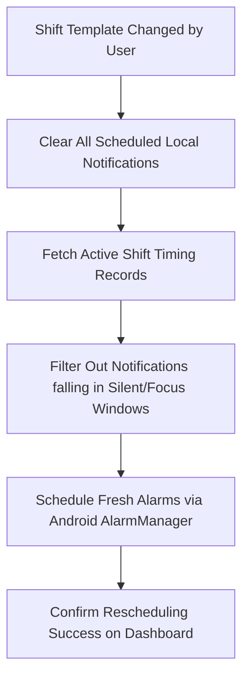

# 2.9 Notifications

**Document ID:** 2.9_Notifications.md  
**Version:** 1.0  
**Status:** In Progress  
**Owner:** Product Owner  
**Last Updated:** July 2026  

---

## 1. Purpose
The purpose of this document is to define the local notifications structure of **LifeOS**. It specifies the timing configurations, shift-based offsets, and automated suppression behaviors designed to keep the user focused and reduce notification fatigue.

---

## 2. Objectives
- Align alarms and push notifications with the active shift schedule.
- Prevent distractions by silencing non-essential alerts during sleep or focus windows.
- Provide a clear template schedule for daily activities.

---

## 3. Scope
This document details functional specifications for push notifications and local alarms. It excludes the coding structure for platform channels, which are located in [20_Notification_Engine.md](file:///d:/LifeOS/Technical/20_Notification_Engine.md).

---

## 4. System Requirements

| Requirement ID | Description | Priority | Traceability |
|---|---|---|---|
| **REQ-NOTIF-001** | The application shall schedule local push notifications on the device without requiring internet connectivity. | Critical | MOD-Notifications |
| **REQ-NOTIF-002** | Changing the active shift template shall immediately reschedule all daily notifications. | Critical | RULE-SHIFT-001 |
| **REQ-NOTIF-003** | The application shall support automatic notification suppression under configured conditions. | High | RULE-NOTIFICATION-001 |

---

## 5. Notification Templates & Timings

#### RULE-NOTIFICATION-001: Shift-Based Timing Specifications
The system schedules daily notification triggers relative to the active shift:

| Shift Template | Trigger Time | Notification Type | Message Content |
|---|---|---|---|
| **Morning Shift** | 09:30 AM | Wake-up Alarm | "Good morning! Time to prepare for your shift." |
| | 10:15 AM | Shift Reminder | "Morning Shift starting in 15 minutes." |
| | 06:30 PM | Shift End | "Shift completed. Enjoy your evening recovery." |
| | 07:25 PM | Focus Reminder | "Deep Work session starting in 5 minutes (Mailing)." |
| | 10:00 PM | Log Check | "Verify today's smoking and screen logs." |
| | 10:30 PM | Sleep Prep | "Wind down starting. Target sleep: 11:00 PM." |
| **Night Shift** | 11:30 AM | Wake-up Alarm | "Good morning! Ready for the day?" |
| | 12:55 PM | Focus Reminder | "Deep Work starting in 5 minutes (Mailing)." |
| | 07:15 PM | Shift Reminder | "Night Shift starting in 15 minutes." |
| | 03:30 AM | Shift End | "Shift completed. Rest and recover." |
| | 03:45 AM | Sleep Prep | "Wind down starting. Target sleep: 4:00 AM." |
| **12-Hour Shift** | 10:30 AM | Wake-up Alarm | "Wake up. Light shift prep today." |
| | 11:45 AM | Shift Reminder | "12-Hour Shift starting in 15 minutes." |
| | 12:00 AM | Shift End | "Shift completed. Head straight to bed." |
| **Off Day** | 08:00 AM | Wake-up Alarm | "Good morning! Enjoy your productive Off Day." |
| | 08:55 AM | Focus Reminder | "Extended Deep Work starting in 5 minutes." |
| | 05:00 PM (Sun) | Weekly Review | "Sunday check-in: Run weekly goals and planning review." |
| | 10:30 PM | Sleep Prep | "Wind down starting. Target sleep: 11:00 PM." |

---

## 6. Notification Rules

#### RULE-NOTIFICATION-002: Focus Mode Suppression
When a **Deep Work focus session** is active, all non-essential habit logging, system logs, and task notifications must be suppressed until the timer expires.

#### RULE-NOTIFICATION-003: Recovery-Based Suppression
If the user's Recovery State is **Burnout Risk**, suppress all project task reminders, focus alerts, and habit notifications. Only "Recovery-focused" alerts (e.g. hydration check, outdoor walk reminder) remain active.

#### RULE-NOTIFICATION-004: Silent Window
No notification of any type (except for explicit wake-up alarms) shall fire between the user's targeted sleep time and wake-up time.

---

## 7. Workflows

### 7.1 Dynamic Notification Updates Workflow

---

## 8. Edge Cases
- **Device Rebooted:** Android clears scheduled alarms upon device reboot. The app must register a `BOOT_COMPLETED` broadcast receiver to re-register all alarms locally.
- **Overdue Notifications:** If a notification trigger time passes while the phone is powered off, the notification must be discarded immediately upon power-on rather than firing late.

---

## 9. Dependencies
- **Android BroadcastReceiver:** To trigger alarm rebuilds.
- **Flutter Local Notifications Plugin:** To handle OS-level notifications formatting.

---

## 10. Open Questions
- **None:** The notification schedule matches user specifications.

---

## 11. Acceptance Criteria
- Setting a focus session successfully blocks standard reminders.
- Changing shift schedules updates trigger offsets immediately.

---

## 12. Approval Checklist
- [x] Conforms to documentation rules.
- [ ] Reviewed by Product Owner.
- [ ] Locked for changes.

---

## 13. Revision History
| Version | Date | Author | Description |
|---|---|---|---|
| 1.0 | July 13, 2026 | Antigravity | Initial draft of the dynamic local notification templates. |