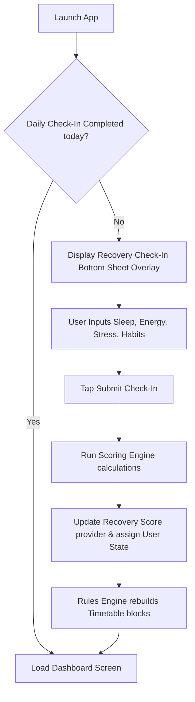
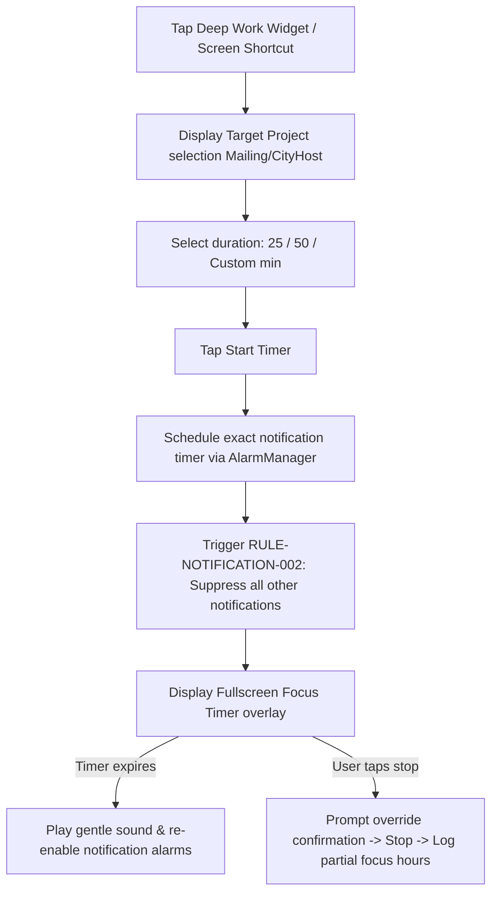

# 03 User Flows

**Document ID:** 03_User_Flows.md  
**Version:** 1.0  
**Status:** Approved  
**Owner:** Product Owner  
**Last Updated:** July 2026  

---

## 1. Purpose
The purpose of this document is to map out the **User Flows** and wireframe navigation paths of LifeOS. These flow diagrams specify the routes, transitions, and decision loops when moving between core views.

---

## 2. Objectives
- Establish standard navigation pathways across the application screens.
- Specify screen state transitions under custom triggers.
- Enforce the "Less Than Three Taps" rule for frequent tasks.

---

## 3. Scope
This document covers screen flows, routes, and modal transition models. It excludes detailed pixel designs, which are located in [08_UI_UX_Specification.md](file:///d:/LifeOS/Design/08_UI_UX_Specification.md).

---

## 4. Flow Specifications

### 4.1 Daily Check-In & Timetable Rebuild Flow
This flow tracks the primary morning check-in transition:

### 4.2 Focus / Deep Work Timer Flow
Tracks focus session launch and silencing triggers:

---

## 5. Modal and Page Transitions
- **Tab Transitions:** Swiping left/right between primary tabs uses a smooth linear glide animation over 150ms.
- **Form Overlays:** Bottom sheets slide vertically from the screen floor over 300ms, using ease-out interpolation curves.

---

## 6. Edge Cases
- **App Interrupted During Check-in:** If the user exits the app mid-form, the current draft inputs must persist in Hive to prevent the user from typing them again upon reload.

---

## 7. Dependencies
- **Design/08_UI_UX_Specification.md:** Screen layouts.
- **Product/02_Master_PRD/2.20_Search_and_Quick_Actions.md:** Floating overlay actions.

---

## 8. Acceptance Criteria
- User can trigger and complete check-ins in under 3 taps.
- Dynamic screen transition states prevent rendering errors on low-memory devices.

---

## 9. Revision History
| Version | Date | Author | Description |
|---|---|---|---|
| 1.0 | July 13, 2026 | Antigravity | Initial draft detailing flow states and overlays. |