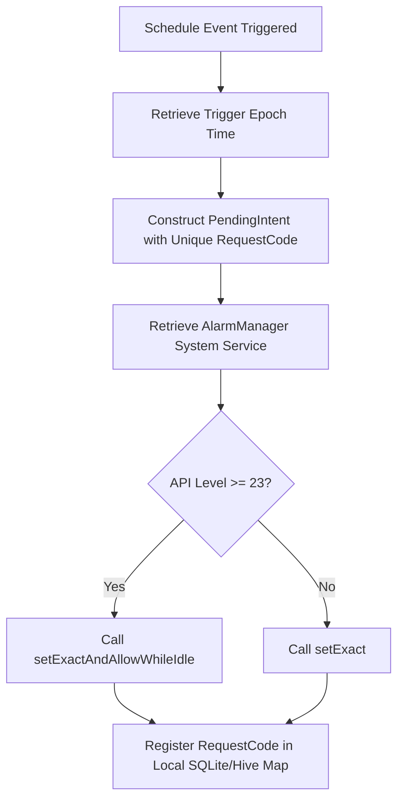

# 20 Notification Engine Technical Design

**Document ID:** 20_Notification_Engine.md  
**Version:** 1.0  
**Status:** In Progress  
**Owner:** Technical Lead  
**Last Updated:** July 2026  

---

## 1. Purpose
The purpose of this document is to detail the technical architecture and platform-level channels of the **Notification Engine** (MOD-Notifications) in LifeOS. It outlines the usage of Android AlarmManager, exact alarms, boot receivers, and dynamic scheduling.

---

## 2. Objectives
- Implement offline-first notifications targeting the Android platform.
- Ensure exact alarm delivery even when the device enters App Standby or Doze Mode.
- Automate alarm re-registration when the device completes booting.

---

## 3. Scope
This document covers low-level Android AlarmManager scheduling, intent filters, broadcast receivers, and local notification plugins. It excludes UI styling, which is defined in [10_Notifications.md](file:///d:/LifeOS/Design/10_Notifications.md).

---

## 4. Technical Architecture & Requirements

| Requirement ID | Description | Priority | Traceability |
|---|---|---|---|
| **REQ-NOTIF-ENG-001** | The application shall register a background `BroadcastReceiver` listening to `android.intent.action.BOOT_COMPLETED`. | Critical | Platform |
| **REQ-NOTIF-ENG-002** | The Notification Engine shall schedule exact alarms using Android `AlarmManager.setExactAndAllowWhileIdle` for precise delivery. | Critical | Platform |
| **REQ-NOTIF-ENG-003** | The Notification Engine shall register localized categories (channels) with custom importance, vibration, and sound profiles. | High | Platform |

---

## 5. Technical Specifications

### 5.1 Android AlarmManager Integration
To bypass battery optimization and Doze Mode restrictions on Android 6.0 (API 23) and above, LifeOS schedules time-critical alarms (wake-ups, shift targets) using:
- **API Call:** `AlarmManager.setExactAndAllowWhileIdle()`
- **Manifest Permission:** `android.permission.SCHEDULE_EXACT_ALARM`
- **PendingIntent:** Routed to a custom `AlarmReceiver` subclassing `BroadcastReceiver`.

### 5.2 Boot Receiver Configuration
Upon device reboot, all scheduled alarms are cleared by the OS. LifeOS handles this via a boot receiver:
```xml
<!-- AndroidManifest.xml snippet -->
<receiver android:name=".receivers.BootReceiver" android:enabled="true" android:exported="false">
    <intent-filter>
        <action android:name="android.intent.action.BOOT_COMPLETED" />
        <action android:name="android.intent.action.MY_PACKAGE_REPLACED" />
    </intent-filter>
</receiver>
```
**BootReceiver Logic:**
1. Intercepts the boot trigger.
2. Initializes Hive boxes in read-only mode in the background.
3. Reads the active shift template and schedules.
4. Re-registers the respective PendingIntents with AlarmManager.

### 5.3 Notification Channels
LifeOS establishes three distinct channels using `FlutterLocalNotificationsPlugin`:
1. **Critical Alarms (Channel ID: `lifeos_alarms`):** High importance, bypasses DND, custom sound, vibration pattern.
2. **Habit Reminders (Channel ID: `lifeos_habits`):** Medium importance, default sound, no screen wake.
3. **Recovery Prompts (Channel ID: `lifeos_recovery`):** Low importance, silent card, no vibration.

---

## 6. Workflows

### 6.1 Exact Alarm Scheduling Loop


---

## 7. Edge Cases
- **Bypassing Battery Optimizations:** Android vendors (Samsung, Xiaomi) enforce aggressive custom battery management. The app must prompt the user to manually disable battery optimization for LifeOS during settings setup.
- **Clock Drift:** System timezone adjustments. The notification scheduler must subscribe to `ACTION_TIMEZONE_CHANGED` and recalculate all active alarm epochs on-the-fly.

---

## 8. Dependencies
- **package:flutter_local_notifications:** Core plugin adapter.
- **Android SDK Level:** $\ge 21$.

---

## 9. Acceptance Criteria
- Device reboot successfully triggers `BootReceiver` and restores alarms within 5 seconds of OS ready.
- System notifications fire on the exact minute scheduled, even in screen-off standby.

---

## 10. Revision History
| Version | Date | Author | Description |
|---|---|---|---|
| 1.0 | July 13, 2026 | Antigravity | Initial detailed technical notification system draft. |