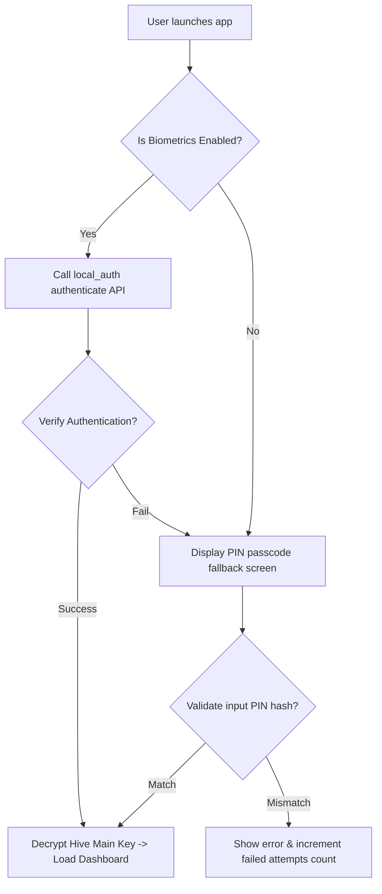

# 21 Security Design

**Document ID:** 21_Security.md  
**Version:** 1.0  
**Status:** In Progress  
**Owner:** Technical Lead  
**Last Updated:** July 2026  

---

## 1. Purpose
The purpose of this document is to specify the **Security and Privacy Architecture** of LifeOS. It details local encryption methods, secure file storage configurations, biometric APIs, permission parameters, and secure database operations.

---

## 2. Objectives
- Protect all local data against reverse engineering and unauthorized device access.
- Implement secure biometrics and passcode interfaces utilizing native platform capabilities.
- Guarantee absolute data privacy, preventing external extraction.

---

## 3. Scope
This document covers cryptography protocols, key derivations, SQLite/Hive secure boxes, PIN authentication, and local permission management in Version 1.0. It excludes multi-tenant network security as it violates the single-user local architecture.

---

## 4. Technical Specifications

### 4.1 Encryption & Secure Key Storage
To protect sensitive data (such as journal entries and habits history), LifeOS utilizes encrypted Hive boxes:
- **Cipher:** AES-256 in Galois/Counter Mode (GCM).
- **Key Storage:** The encryption key is generated securely on first launch using a Cryptographically Secure Pseudo-Random Number Generator (CSPRNG).
- **Keychain/Keystore:** The generated key is persisted securely in the device's hardware-backed keystore:
  - **Android:** Android Keystore Provider (via `flutter_secure_storage`).
  - **iOS:** iOS Keychain Services.

### 4.2 Biometric & PIN Login
- **Package:** `local_auth` Flutter package.
- **Biometric Integration:** Integrates with Android BiometricPrompt API and iOS LocalAuthentication.
- **PIN Lock:** A 4-to-6 digit passcode fallback. The passcode hash is derived using PBKDF2 with SHA-256 and stored in the secure storage box. It is verified locally without any internet connection.

### 4.3 Backup & Data Protection
- **Backup Encryption:** Backups exported via the settings menu must utilize AES-256-GCM. The key is derived from the user's custom recovery password using PBKDF2 with a salt and 10,000 iterations.
- **Data Locality:** All app database files are restricted to the application's private directory (`/data/user/0/com.lifeos.app/` on Android). Direct access from other applications is blocked by the OS sandbox.

### 4.4 Permission Management
LifeOS requests only the narrowest possible set of permissions:
- `android.permission.PACKAGE_USAGE_STATS`: (For screen time tracking).
- `android.permission.SCHEDULE_EXACT_ALARM`: (For exact notification timing).
- `android.permission.RECEIVE_BOOT_COMPLETED`: (For restoring alarms).
- No internet permission (`android.permission.INTERNET`) is specified in the release manifest, making network leakage impossible.

---

## 5. Workflows

### 5.1 Biometric Authentication Workflow

---

## 6. Edge Cases
- **Hardware Without Secure Element:** On extremely old devices lacking hardware-backed keystores, fallback to standard shared preference encryption with software obfuscated keys.
- **Brute Force Defense:** If the user inputs an incorrect PIN 5 times consecutively, lock the authentication interface for 30 seconds. Double the lock time for each subsequent failure.

---

## 7. Dependencies
- **package:flutter_secure_storage:** Interface for Keystore/Keychain.
- **package:local_auth:** Biometric prompt bridge.

---

## 8. Acceptance Criteria
- APK static analysis verifies the complete absence of `android.permission.INTERNET` in the compiled manifest.
- Modifying a backup ZIP payload manually triggers a verification failure during decryption.

---

## 9. Revision History
| Version | Date | Author | Description |
|---|---|---|---|
| 1.0 | July 13, 2026 | Antigravity | Initial draft detailing encryption, local authentication, and permissions. |