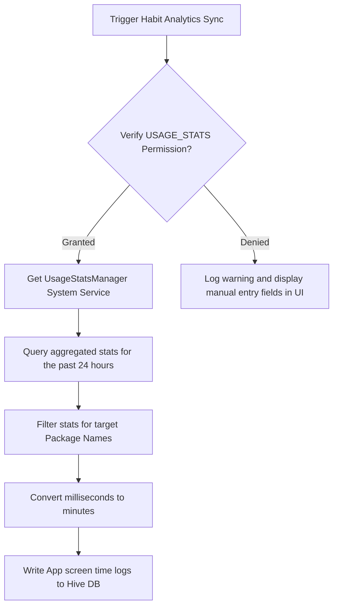

# 22 Third Party Integrations

**Document ID:** 22_Third_Party_Integrations.md  
**Version:** 1.0  
**Status:** In Progress  
**Owner:** Technical Lead  
**Last Updated:** July 2026  

---

## 1. Purpose
The purpose of this document is to specify the technical interfaces, APIs, and drivers that govern **Third-Party Integrations** in LifeOS. Centralizing these adapters ensures that optional integrations (such as Health Connect and Google Calendar) do not couple with the core app logic.

---

## 2. Objectives
- Outline execution pipelines for optional integrations.
- Establish guidelines for data synchronization, permissions, and fallbacks.
- Ensure integration drivers do not require external cloud server proxies.

---

## 3. Scope
This document details technical integrations with Health Connect, Android Usage Stats API, Google Calendar, Home Screen Widgets, and future Wear OS / Voice Recognition endpoints.

---

## 4. Integration Specifications

### 4.1 Android Usage Stats API (Screen Time Telemetry)
- **Framework API:** `UsageStatsManager` (specifically `queryEvents` or `queryAndAggregateUsageStats`).
- **Data Target:** Screen time usage for: Instagram (`com.instagram.android`), YouTube (`com.google.android.youtube`), Chrome (`com.android.chrome`), and WhatsApp (`com.whatsapp`).
- **Sync Trigger:** Executed daily upon check-in initialization.
- **Manual Fallback:** If permission is denied, UI falls back to manual sliding input logs.

### 4.2 Health Connect (Optional Wearable Sync)
- **Framework API:** Google Health Connect Android SDK (`androidx.health.connect:connect-client`).
- **Permissions requested:**
  - `HealthPermissions.READ_SLEEP`
  - `HealthPermissions.READ_STEPS`
  - `HealthPermissions.READ_ACTIVE_CALORIES_BURNED`
- **Data Reconciliation:** If sleep data is found in Health Connect, the check-in form auto-fills start/end times and calculates duration. The user can manually override the imported values.

### 4.3 Google Calendar API (Future Version 2.0)
- **Protocol:** Direct local HTTP REST queries to the Google Calendar API via OAuth2, executing from the device client. No server side code is allowed.
- **Library:** `googleapis/calendar/v3` Dart package.
- **Authentication:** Local token refresh loop managed securely in `flutter_secure_storage`.

### 4.4 Home Screen Widgets (Future Version 2.0)
- **Android:** Native widgets built using **Glance** (Jetpack Glance) or custom Kotlin AppWidgetProvider.
- **iOS:** WidgetKit using Swift.
- **Data Layer:** Flutter shares data with native widget platforms using SQLite files or Shared Preferences container files (e.g. App Groups on iOS, Shared Preferences with custom processes on Android).

---

## 5. Workflows

### 5.1 Android Usage Stats Query Workflow

---

## 6. Edge Cases
- **Health Connect Service Unavailable:** On older Android versions or devices without Health Connect installed, the app must catch the `HealthConnectException` gracefully, disable the sync configuration toggles, and direct the user to manual check-ins.
- **Usage Stats API Data Delays:** Android OS occasionally delays updating aggregated usage stats. The query logic must look back 36 hours and update historical records if counts differ.

---

## 7. Dependencies
- **androidx.health.connect:connect-client:** (Optional dependency).
- **Google OAuth2 library:** (For client-side Calendar connections in V2.0).

---

## 8. Acceptance Criteria
- Toggling "Health Connect Sync" off disables background check routines immediately.
- Denying permissions does not crash the app or prevent manual habit/sleep entries.

---

## 9. Revision History
| Version | Date | Author | Description |
|---|---|---|---|
| 1.0 | July 13, 2026 | Antigravity | Initial draft defining third-party integrations and platform SDKs. |