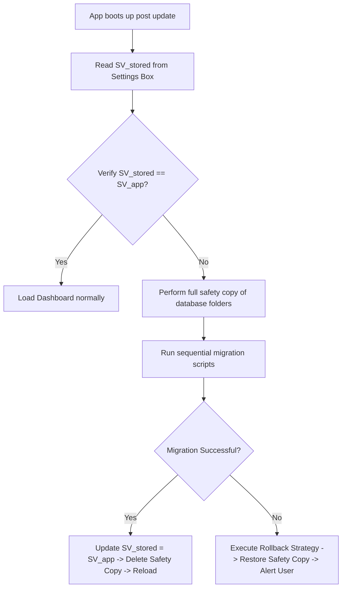

# Migration Strategy

**Document ID:** Migration_Strategy.md  
**Version:** 1.0  
**Status:** In Progress  
**Owner:** Technical Lead  
**Last Updated:** July 2026  

---

## 1. Purpose
The purpose of this document is to specify the technical strategy for database schema updates, backup file version compatibility, settings migrations, and safety rollbacks in LifeOS.

---

## 2. Objectives
- Guarantee that future application updates do not cause data corruption or data loss in the local Hive database.
- Establish a strict backup compatibility policy across different build numbers.
- Provide a robust rollback pipeline for failed local updates.

---

## 3. Scope
This document covers local Hive database schema transitions, backup decryption version mapping, and local preference upgrades in Version 1.0. It excludes server-side API migration policies.

---

## 4. Technical Specifications

### 4.1 Schema Versioning
- **Database Schema Version:** Represented as an integer ($SV$) in the settings configuration.
- **Hive Box Adapters:** Every TypeAdapter registered in Hive must declare a unique TypeId. If a schema change occurs, a new TypeAdapter is registered or the existing adapter is modified to support nullable new fields.

### 4.2 Migration Routine (RULE-MIGRATE-001)
Upon application update, if the stored Schema Version ($SV_{stored}$) is less than the active App Schema Version ($SV_{app}$), the app triggers sequential migrations:
```dart
void migrate(int oldVersion, int newVersion) {
  if (oldVersion < 2) {
    // Run migration script to move from SV 1 to SV 2 (e.g. adding triggers to smoking entries)
  }
  if (oldVersion < 3) {
    // Run migration script for SV 3
  }
}
```

### 4.3 Backup Compatibility
- **Backward Compatibility:** Future versions of the app must always support importing backup files created by older versions.
- **Forward Compatibility:** Older versions of the app must reject backups created by newer versions (as defined in [2.11_Backup_System.md](file:///d:/LifeOS/Product/02_Master_PRD/2.11_Backup_System.md#L45-L65)).

### 4.4 Rollback Strategy
If a database migration throws an unhandled exception:
1. Immediately abort the write sequence.
2. Restore the pre-migration safety backup files saved in the cache.
3. Lock the database in its previous version state.
4. Prompt the user with a warning card suggesting app downgrades or reporting the bug.

---

## 5. Workflows

### 5.1 App Update Verification Workflow


---

## 6. Edge Cases
- **Missing Migration Script:** If a schema mismatch is detected but no migration script is defined, the app must preserve data, flag the fields as unread, and write a warning log to prevent data erasure.

---

## 7. Dependencies
- **Hive TypeAdapters:** To read historic models.
- **MOD-Settings:** Source of Schema Version logs.

---

## 8. Acceptance Criteria
- Simulating database upgrades via unit tests successfully migrates older records to the new model without losing entry counts.
- Backup restores run migrations correctly based on metadata parameters.

---

## 9. Revision History
| Version | Date | Author | Description |
|---|---|---|---|
| 1.0 | July 13, 2026 | Antigravity | Initial draft defining update migrations and rollback policies. |
