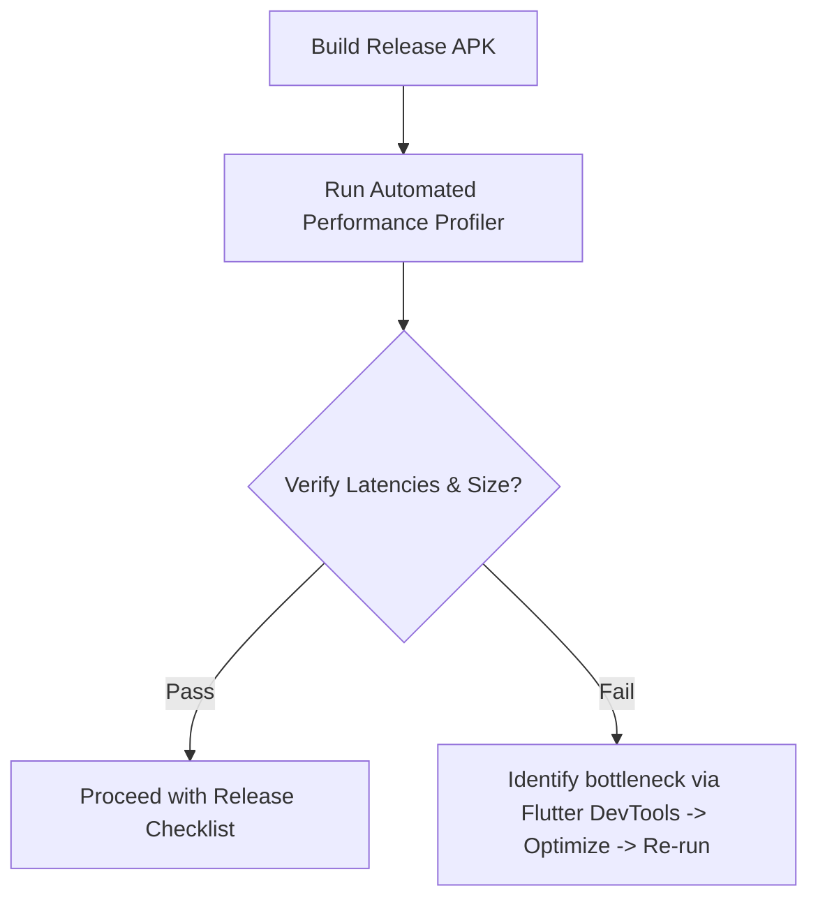

# Performance Budget

**Document ID:** Performance_Budget.md  
**Version:** 1.0  
**Status:** In Progress  
**Owner:** Technical Lead  
**Last Updated:** July 2026  

---

## 1. Purpose
The purpose of this document is to define the measurable performance targets, hardware footprints, and execution thresholds that the LifeOS development team must adhere to. Maintaining these budgets keeps the application fast and responsive on mid-range Android devices.

---

## 2. Objectives
- Ensure the application opens and responds in under 2 seconds.
- Restrict disk, memory, and battery footprints to minimize system impact.
- Establish strict benchmarks for database read/write latencies.

---

## 3. Scope
This document applies to all compiled builds and target devices for Version 1.0. It defines the metrics, targets, testing methods, and budgets.

---

## 4. Performance Targets & Budgets

### 4.1 UI & Latency Targets

| Target Metric | Budget Threshold | Measurement Method | Traceability |
|---|---|---|---|
| **App Cold Start** | $\le 2.0$ seconds | Measured from main launch trigger to responsive dashboard. | REQ-NFR-001 |
| **Local DB Read** | $\le 50$ milliseconds | Hive box read queries for daily records. | REQ-NFR-002 |
| **Local DB Write** | $\le 50$ milliseconds | Hive box updates (e.g. log increments). | REQ-NFR-003 |
| **Frame Render Rate** | $\ge 60$ FPS (target 120 FPS) | Profile frame updates during scrolling. | REQ-NFR-004 |

### 4.2 Hardware & Package Footprint

| Target Metric | Budget Threshold | Measurement Method | Traceability |
|---|---|---|---|
| **APK Install Size** | $< 50$ Megabytes | Compressed APK size in release configuration. | REQ-NFR-008 |
| **RAM Utilization** | $\le 150$ Megabytes | Persistent heap memory size during runtime. | Platform |
| **Daily Battery Draw** | $< 2\%$ total capacity | Measured over 24h background battery stats. | Platform |

---

## 5. Optimization & Enforcement Rules

#### RULE-PERF-001: DB Query Compaction
- Database operations must utilize lazy loading for historical lists.
- Monthly archives must be stored in separate Hive boxes to prevent overloading memory during initial dashboard reads.

#### RULE-PERF-002: Frame Budget Protection
- Avoid complex computational logic inside Flutter build methods.
- Expensive operations (e.g. computing database backups or analytics correlations) must run on background threads using Dart Isolates.

---

## 6. Workflows

### 6.1 Performance Verification Workflow

---

## 7. Edge Cases
- **Atypical Data Volume:** If the user has used the app for 5+ years, local database lookups can slow down. The system must execute auto-compaction and index pruning if database size exceeds 100MB.

---

## 8. Dependencies
- **Flutter DevTools Profiler:** For latency and memory measurements.

---

## 9. Acceptance Criteria
- Profile build runs meet app cold start and database latency targets consistently under testing.

---

## 10. Revision History
| Version | Date | Author | Description |
|---|---|---|---|
| 1.0 | July 13, 2026 | Antigravity | Initial draft defining performance metrics and targets. |
