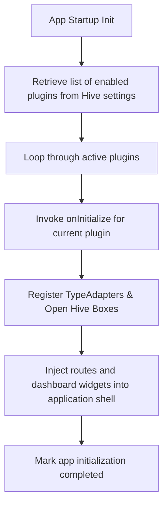

# Plugin Architecture

**Document ID:** Plugin_Architecture.md  
**Version:** 1.0  
**Status:** In Progress  
**Owner:** Technical Lead  
**Last Updated:** July 2026  

---

## 1. Purpose
The purpose of this document is to define the interface contracts, lifecycle methods, and extension points that compose the **Plugin Architecture** of LifeOS. This ensures future integrations (such as Wear OS, widgets, or custom tracking modules) can register without modifying the core codebase.

---

## 2. Objectives
- Establish clean architectural boundaries between core engines and peripheral modules.
- Specify standardized lifecycle hooks (init, start, pause, resume, destroy) for modular plugins.
- Define API contracts to protect app stability during module load sequences.

---

## 3. Scope
This document covers module registration interfaces, background service hooks, and API contracts for Version 1.0. It excludes actual third-party developer plugin store logic.

---

## 4. Technical Specifications

### 4.1 Module Registration
Every feature module (e.g. MOD-Mailing, MOD-CityHost) must implement the `LifeOSPlugin` interface:
```dart
abstract class LifeOSPlugin {
  String get pluginId;
  String get displayName;
  
  Future<void> onInitialize();
  Future<void> onShutdown();
  
  // Extension hooks
  List<Widget> get dashboardWidgets;
  List<Route> get routes;
}
```

### 4.2 Plugin Lifecycle Hooks
Plugins undergo a controlled lifecycle managed by the main app shell:
1. **Initialize:** Registered on app startup. Safe place to register Hive boxes.
2. **Foreground/Background shifts:** Triggers when the app shifts state.
3. **Shutdown:** Invoked when database resets or app closes safely.

### 4.3 Extension Points
The core dashboard reserves three extension points where plugins can insert components:
1. **Dashboard Widget Slot:** Vertical scroll list where registered module widgets render.
2. **Settings Menu Slot:** Adds configuration panels.
3. **Daily Timetable Block Slot:** Allows custom tasks to register in the planner timeline.

---

## 5. Workflows

### 5.1 Plugin Registration Workflow


---

## 6. Edge Cases
- **Plugin Initialization Timeout:** If a plugin's `onInitialize` routine hangs for more than 2.0 seconds, the main app boot sequence must log a startup exception, skip loading that plugin, and launch the rest of the application normally.

---

## 7. Dependencies
- **Riverpod Providers:** For state injection across plugin boundaries.

---

## 8. Acceptance Criteria
- Custom plugins can be added and successfully initialize without changing code in other features.
- Timeout exceptions are handled gracefully during app cold starts.

---

## 9. Revision History
| Version | Date | Author | Description |
|---|---|---|---|
| 1.0 | July 13, 2026 | Antigravity | Initial draft detailing modular plugin interfaces. |
